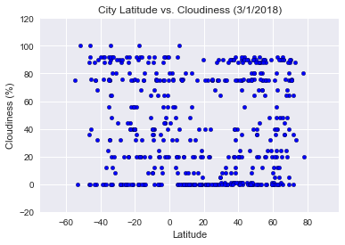
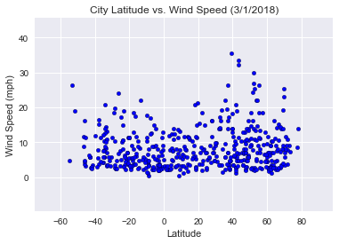

# WeatherPy
## Analysis
 - The closer a city is to the equator, the higher the temperature (F) of that city. This is noted in the "City Latitude vs. Temperature (3/1/2018)" graph, below, where the highest data points for temperature are above the "0" latitude (note that the equator is at latitude "0").
 - The Northern Hemisphere typically has higher wind speeds (mph). This is indicated in the "City Latitude vs. Wind Speed (3/1/2018)" graph where the data points for wind speed for cities in the Nothern Hemisphere (latitudes 0 to 90) are higher than for cities in the Southern Hemisphere (latitude -90 to 0).
 - The Southern Hemisphere typically has higher humidity %). This is indicated in the "City Latitude vs. Humidity (3/1/2018)" graph where there is greater number of data points with higher humidty for cities in the Souther Hemisphere (latitudes -90 to 0) than for cities in the Northern Hemisphere (latitude 0 to 90).
  


```python
# Import Dependencies
import requests as req
import json
from citipy import citipy
from random import uniform
import pandas as pd
import matplotlib.pyplot as plt
import seaborn as sns
```


```python
# API config and URL info
api_key = "84fe59f3ffa1bf7920c39149bf3dde70"
url = "http://api.openweathermap.org/data/2.5/weather?"
```


```python
## Generate random lng/lat to put into citipy (citipy take in 2 coordinates (lng, lat))

# Functions for generating random latitude
def rand_lat():
  return uniform(-90, 90)

# Function for generating random longitude
def rand_lng():
  return uniform(-180,180)
```


```python
# Create empty df to hold weather data for each city 
weather_data_df = pd.DataFrame(columns=["City", "Cloudiness", "Country", "Date", "Humidity", "Lat", "Lng", "Temperature", "Wind Speed"])

# Create initial variables for looping
counter = 0
unique_cities = []

# Initial print header for output log
print("Beginning Data Retrieval")
print("---------------------------")

# While loop to only capture cities without null weather data
while counter < 500:
    # Retrieve a city for each random lat/lng generated
    # Obtain the JSON response for each city
    city = citipy.nearest_city(rand_lat(), rand_lng())
    query_url =  url + "appid=" + api_key + "&q=" + city.city_name + "," + city.country_code + "&units=imperial"
    weather_response = req.get(query_url)
    weather_json = weather_response.json()
    
    # If statement for only cities with weather data (internal paramer "cod" = 200)
    if weather_json["cod"] == 200:
        # Check for duplicates
        if weather_json["name"] not in unique_cities:
            # Append weather data for the city to df
            weather_data_df = weather_data_df.append([{"City": weather_json["name"],
                                                       "Temperature": weather_json["main"]["temp"],
                                                       "Humidity": weather_json["main"]["humidity"],
                                                       "Cloudiness": weather_json["clouds"]["all"],
                                                       "Wind Speed": weather_json["wind"]["speed"],
                                                       "Lat": weather_json["coord"]["lat"],
                                                       "Country": weather_json["sys"]["country"],
                                                       "Lng": weather_json["coord"]["lon"],
                                                       "Date": weather_json["dt"]
                                                      }])
            
            # Add to city-weather data confirmed counter         
            counter += 1
            
            # Append the city to the unique cities list
            unique_cities.append(weather_json["name"])
        
            # Print log statements
            print("Processing Record #" + str(counter) + " | City ID: " + str(weather_json["id"]) + " | City Name: " + city.city_name)
            print(query_url)

```

    Beginning Data Retrieval
    ---------------------------
    Processing Record #1 | City ID: 4030556 | City Name: rikitea
    http://api.openweathermap.org/data/2.5/weather?appid=84fe59f3ffa1bf7920c39149bf3dde70&q=rikitea,pf&units=imperial
    Processing Record #2 | City ID: 2163355 | City Name: hobart
    http://api.openweathermap.org/data/2.5/weather?appid=84fe59f3ffa1bf7920c39149bf3dde70&q=hobart,au&units=imperial
    Processing Record #3 | City ID: 4020109 | City Name: atuona
    http://api.openweathermap.org/data/2.5/weather?appid=84fe59f3ffa1bf7920c39149bf3dde70&q=atuona,pf&units=imperial
    Processing Record #4 | City ID: 3369157 | City Name: cape town
    http://api.openweathermap.org/data/2.5/weather?appid=84fe59f3ffa1bf7920c39149bf3dde70&q=cape town,za&units=imperial
    Processing Record #5 | City ID: 4252975 | City Name: barrow
    http://api.openweathermap.org/data/2.5/weather?appid=84fe59f3ffa1bf7920c39149bf3dde70&q=barrow,us&units=imperial
    Processing Record #6 | City ID: 779554 | City Name: honningsvag
    http://api.openweathermap.org/data/2.5/weather?appid=84fe59f3ffa1bf7920c39149bf3dde70&q=honningsvag,no&units=imperial
    Processing Record #7 | City ID: 5411479 | City Name: alamosa
    http://api.openweathermap.org/data/2.5/weather?appid=84fe59f3ffa1bf7920c39149bf3dde70&q=alamosa,us&units=imperial
    Processing Record #8 | City ID: 739914 | City Name: sebinkarahisar
    http://api.openweathermap.org/data/2.5/weather?appid=84fe59f3ffa1bf7920c39149bf3dde70&q=sebinkarahisar,tr&units=imperial
    Processing Record #9 | City ID: 5855927 | City Name: hilo
    http://api.openweathermap.org/data/2.5/weather?appid=84fe59f3ffa1bf7920c39149bf3dde70&q=hilo,us&units=imperial
    Processing Record #10 | City ID: 2110227 | City Name: butaritari
    http://api.openweathermap.org/data/2.5/weather?appid=84fe59f3ffa1bf7920c39149bf3dde70&q=butaritari,ki&units=imperial
    Processing Record #11 | City ID: 577240 | City Name: osinovo
    http://api.openweathermap.org/data/2.5/weather?appid=84fe59f3ffa1bf7920c39149bf3dde70&q=osinovo,ru&units=imperial
    Processing Record #12 | City ID: 3833367 | City Name: ushuaia
    http://api.openweathermap.org/data/2.5/weather?appid=84fe59f3ffa1bf7920c39149bf3dde70&q=ushuaia,ar&units=imperial
    Processing Record #13 | City ID: 934479 | City Name: grand gaube
    http://api.openweathermap.org/data/2.5/weather?appid=84fe59f3ffa1bf7920c39149bf3dde70&q=grand gaube,mu&units=imperial
    Processing Record #14 | City ID: 3874787 | City Name: punta arenas
    http://api.openweathermap.org/data/2.5/weather?appid=84fe59f3ffa1bf7920c39149bf3dde70&q=punta arenas,cl&units=imperial
    Processing Record #15 | City ID: 1006984 | City Name: east london
    http://api.openweathermap.org/data/2.5/weather?appid=84fe59f3ffa1bf7920c39149bf3dde70&q=east london,za&units=imperial
    Processing Record #16 | City ID: 964432 | City Name: port alfred
    http://api.openweathermap.org/data/2.5/weather?appid=84fe59f3ffa1bf7920c39149bf3dde70&q=port alfred,za&units=imperial
    Processing Record #17 | City ID: 2109701 | City Name: auki
    http://api.openweathermap.org/data/2.5/weather?appid=84fe59f3ffa1bf7920c39149bf3dde70&q=auki,sb&units=imperial
    Processing Record #18 | City ID: 2077963 | City Name: albany
    http://api.openweathermap.org/data/2.5/weather?appid=84fe59f3ffa1bf7920c39149bf3dde70&q=albany,au&units=imperial
    Processing Record #19 | City ID: 2206939 | City Name: bluff
    http://api.openweathermap.org/data/2.5/weather?appid=84fe59f3ffa1bf7920c39149bf3dde70&q=bluff,nz&units=imperial
    Processing Record #20 | City ID: 2123814 | City Name: leningradskiy
    http://api.openweathermap.org/data/2.5/weather?appid=84fe59f3ffa1bf7920c39149bf3dde70&q=leningradskiy,ru&units=imperial
    Processing Record #21 | City ID: 3985168 | City Name: san patricio
    http://api.openweathermap.org/data/2.5/weather?appid=84fe59f3ffa1bf7920c39149bf3dde70&q=san patricio,mx&units=imperial
    Processing Record #22 | City ID: 5469841 | City Name: grants
    http://api.openweathermap.org/data/2.5/weather?appid=84fe59f3ffa1bf7920c39149bf3dde70&q=grants,us&units=imperial
    Processing Record #23 | City ID: 6320062 | City Name: vila velha
    http://api.openweathermap.org/data/2.5/weather?appid=84fe59f3ffa1bf7920c39149bf3dde70&q=vila velha,br&units=imperial
    Processing Record #24 | City ID: 2075265 | City Name: busselton
    http://api.openweathermap.org/data/2.5/weather?appid=84fe59f3ffa1bf7920c39149bf3dde70&q=busselton,au&units=imperial
    Processing Record #25 | City ID: 1215502 | City Name: banda aceh
    http://api.openweathermap.org/data/2.5/weather?appid=84fe59f3ffa1bf7920c39149bf3dde70&q=banda aceh,id&units=imperial
    Processing Record #26 | City ID: 3893629 | City Name: coquimbo
    http://api.openweathermap.org/data/2.5/weather?appid=84fe59f3ffa1bf7920c39149bf3dde70&q=coquimbo,cl&units=imperial
    Processing Record #27 | City ID: 4267710 | City Name: sitka
    http://api.openweathermap.org/data/2.5/weather?appid=84fe59f3ffa1bf7920c39149bf3dde70&q=sitka,us&units=imperial
    Processing Record #28 | City ID: 359792 | City Name: aswan
    http://api.openweathermap.org/data/2.5/weather?appid=84fe59f3ffa1bf7920c39149bf3dde70&q=aswan,eg&units=imperial
    Processing Record #29 | City ID: 286621 | City Name: salalah
    http://api.openweathermap.org/data/2.5/weather?appid=84fe59f3ffa1bf7920c39149bf3dde70&q=salalah,om&units=imperial
    Processing Record #30 | City ID: 3652764 | City Name: puerto ayora
    http://api.openweathermap.org/data/2.5/weather?appid=84fe59f3ffa1bf7920c39149bf3dde70&q=puerto ayora,ec&units=imperial
    Processing Record #31 | City ID: 2208248 | City Name: kaitangata
    http://api.openweathermap.org/data/2.5/weather?appid=84fe59f3ffa1bf7920c39149bf3dde70&q=kaitangata,nz&units=imperial
    Processing Record #32 | City ID: 244878 | City Name: biltine
    http://api.openweathermap.org/data/2.5/weather?appid=84fe59f3ffa1bf7920c39149bf3dde70&q=biltine,td&units=imperial
    Processing Record #33 | City ID: 4032243 | City Name: vaini
    http://api.openweathermap.org/data/2.5/weather?appid=84fe59f3ffa1bf7920c39149bf3dde70&q=vaini,to&units=imperial
    Processing Record #34 | City ID: 2185329 | City Name: waipawa
    http://api.openweathermap.org/data/2.5/weather?appid=84fe59f3ffa1bf7920c39149bf3dde70&q=waipawa,nz&units=imperial
    Processing Record #35 | City ID: 117656 | City Name: salmas
    http://api.openweathermap.org/data/2.5/weather?appid=84fe59f3ffa1bf7920c39149bf3dde70&q=salmas,ir&units=imperial
    Processing Record #36 | City ID: 3838874 | City Name: rio cuarto
    http://api.openweathermap.org/data/2.5/weather?appid=84fe59f3ffa1bf7920c39149bf3dde70&q=rio cuarto,ar&units=imperial
    Processing Record #37 | City ID: 2132606 | City Name: samarai
    http://api.openweathermap.org/data/2.5/weather?appid=84fe59f3ffa1bf7920c39149bf3dde70&q=samarai,pg&units=imperial
    Processing Record #38 | City ID: 3466165 | City Name: cidreira
    http://api.openweathermap.org/data/2.5/weather?appid=84fe59f3ffa1bf7920c39149bf3dde70&q=cidreira,br&units=imperial
    Processing Record #39 | City ID: 3458498 | City Name: linhares
    http://api.openweathermap.org/data/2.5/weather?appid=84fe59f3ffa1bf7920c39149bf3dde70&q=linhares,br&units=imperial
    Processing Record #40 | City ID: 1650434 | City Name: bambanglipuro
    http://api.openweathermap.org/data/2.5/weather?appid=84fe59f3ffa1bf7920c39149bf3dde70&q=bambanglipuro,id&units=imperial
    Processing Record #41 | City ID: 553725 | City Name: kamenka
    http://api.openweathermap.org/data/2.5/weather?appid=84fe59f3ffa1bf7920c39149bf3dde70&q=kamenka,ru&units=imperial
    Processing Record #42 | City ID: 1489504 | City Name: togul
    http://api.openweathermap.org/data/2.5/weather?appid=84fe59f3ffa1bf7920c39149bf3dde70&q=togul,ru&units=imperial
    Processing Record #43 | City ID: 1214488 | City Name: meulaboh
    http://api.openweathermap.org/data/2.5/weather?appid=84fe59f3ffa1bf7920c39149bf3dde70&q=meulaboh,id&units=imperial
    Processing Record #44 | City ID: 5972762 | City Name: hay river
    http://api.openweathermap.org/data/2.5/weather?appid=84fe59f3ffa1bf7920c39149bf3dde70&q=hay river,ca&units=imperial
    Processing Record #45 | City ID: 6170031 | City Name: tuktoyaktuk
    http://api.openweathermap.org/data/2.5/weather?appid=84fe59f3ffa1bf7920c39149bf3dde70&q=tuktoyaktuk,ca&units=imperial
    Processing Record #46 | City ID: 6165406 | City Name: thompson
    http://api.openweathermap.org/data/2.5/weather?appid=84fe59f3ffa1bf7920c39149bf3dde70&q=thompson,ca&units=imperial
    Processing Record #47 | City ID: 964420 | City Name: port elizabeth
    http://api.openweathermap.org/data/2.5/weather?appid=84fe59f3ffa1bf7920c39149bf3dde70&q=port elizabeth,za&units=imperial
    Processing Record #48 | City ID: 2152659 | City Name: port macquarie
    http://api.openweathermap.org/data/2.5/weather?appid=84fe59f3ffa1bf7920c39149bf3dde70&q=port macquarie,au&units=imperial
    Processing Record #49 | City ID: 3932145 | City Name: pisco
    http://api.openweathermap.org/data/2.5/weather?appid=84fe59f3ffa1bf7920c39149bf3dde70&q=pisco,pe&units=imperial
    Processing Record #50 | City ID: 2964782 | City Name: dingle
    http://api.openweathermap.org/data/2.5/weather?appid=84fe59f3ffa1bf7920c39149bf3dde70&q=dingle,ie&units=imperial
    Processing Record #51 | City ID: 978895 | City Name: margate
    http://api.openweathermap.org/data/2.5/weather?appid=84fe59f3ffa1bf7920c39149bf3dde70&q=margate,za&units=imperial
    Processing Record #52 | City ID: 1485020 | City Name: znamenskoye
    http://api.openweathermap.org/data/2.5/weather?appid=84fe59f3ffa1bf7920c39149bf3dde70&q=znamenskoye,ru&units=imperial
    Processing Record #53 | City ID: 3418910 | City Name: upernavik
    http://api.openweathermap.org/data/2.5/weather?appid=84fe59f3ffa1bf7920c39149bf3dde70&q=upernavik,gl&units=imperial
    Processing Record #54 | City ID: 2129868 | City Name: iwanai
    http://api.openweathermap.org/data/2.5/weather?appid=84fe59f3ffa1bf7920c39149bf3dde70&q=iwanai,jp&units=imperial
    Processing Record #55 | City ID: 6185377 | City Name: yellowknife
    http://api.openweathermap.org/data/2.5/weather?appid=84fe59f3ffa1bf7920c39149bf3dde70&q=yellowknife,ca&units=imperial
    Processing Record #56 | City ID: 1507390 | City Name: dikson
    http://api.openweathermap.org/data/2.5/weather?appid=84fe59f3ffa1bf7920c39149bf3dde70&q=dikson,ru&units=imperial
    Processing Record #57 | City ID: 935215 | City Name: saint-philippe
    http://api.openweathermap.org/data/2.5/weather?appid=84fe59f3ffa1bf7920c39149bf3dde70&q=saint-philippe,re&units=imperial
    Processing Record #58 | City ID: 3863379 | City Name: mar del plata
    http://api.openweathermap.org/data/2.5/weather?appid=84fe59f3ffa1bf7920c39149bf3dde70&q=mar del plata,ar&units=imperial
    Processing Record #59 | City ID: 1605279 | City Name: trat
    http://api.openweathermap.org/data/2.5/weather?appid=84fe59f3ffa1bf7920c39149bf3dde70&q=trat,th&units=imperial
    Processing Record #60 | City ID: 1015776 | City Name: bredasdorp
    http://api.openweathermap.org/data/2.5/weather?appid=84fe59f3ffa1bf7920c39149bf3dde70&q=bredasdorp,za&units=imperial
    Processing Record #61 | City ID: 1058381 | City Name: morondava
    http://api.openweathermap.org/data/2.5/weather?appid=84fe59f3ffa1bf7920c39149bf3dde70&q=morondava,mg&units=imperial
    Processing Record #62 | City ID: 2176639 | City Name: batemans bay
    http://api.openweathermap.org/data/2.5/weather?appid=84fe59f3ffa1bf7920c39149bf3dde70&q=batemans bay,au&units=imperial
    Processing Record #63 | City ID: 3465342 | City Name: corumba
    http://api.openweathermap.org/data/2.5/weather?appid=84fe59f3ffa1bf7920c39149bf3dde70&q=corumba,br&units=imperial
    Processing Record #64 | City ID: 2525471 | City Name: la maddalena
    http://api.openweathermap.org/data/2.5/weather?appid=84fe59f3ffa1bf7920c39149bf3dde70&q=la maddalena,it&units=imperial
    Processing Record #65 | City ID: 3471451 | City Name: arraial do cabo
    http://api.openweathermap.org/data/2.5/weather?appid=84fe59f3ffa1bf7920c39149bf3dde70&q=arraial do cabo,br&units=imperial
    Processing Record #66 | City ID: 6167817 | City Name: torbay
    http://api.openweathermap.org/data/2.5/weather?appid=84fe59f3ffa1bf7920c39149bf3dde70&q=torbay,ca&units=imperial
    Processing Record #67 | City ID: 4407665 | City Name: kodiak
    http://api.openweathermap.org/data/2.5/weather?appid=84fe59f3ffa1bf7920c39149bf3dde70&q=kodiak,us&units=imperial
    Processing Record #68 | City ID: 3381428 | City Name: iracoubo
    http://api.openweathermap.org/data/2.5/weather?appid=84fe59f3ffa1bf7920c39149bf3dde70&q=iracoubo,gf&units=imperial
    Processing Record #69 | City ID: 3366880 | City Name: hermanus
    http://api.openweathermap.org/data/2.5/weather?appid=84fe59f3ffa1bf7920c39149bf3dde70&q=hermanus,za&units=imperial
    Processing Record #70 | City ID: 3361934 | City Name: saldanha
    http://api.openweathermap.org/data/2.5/weather?appid=84fe59f3ffa1bf7920c39149bf3dde70&q=saldanha,za&units=imperial
    Processing Record #71 | City ID: 3465748 | City Name: conceicao do coite
    http://api.openweathermap.org/data/2.5/weather?appid=84fe59f3ffa1bf7920c39149bf3dde70&q=conceicao do coite,br&units=imperial
    Processing Record #72 | City ID: 2022083 | City Name: alekseyevsk
    http://api.openweathermap.org/data/2.5/weather?appid=84fe59f3ffa1bf7920c39149bf3dde70&q=alekseyevsk,ru&units=imperial
    Processing Record #73 | City ID: 2757220 | City Name: den helder
    http://api.openweathermap.org/data/2.5/weather?appid=84fe59f3ffa1bf7920c39149bf3dde70&q=den helder,nl&units=imperial
    Processing Record #74 | City ID: 5699404 | City Name: scottsbluff
    http://api.openweathermap.org/data/2.5/weather?appid=84fe59f3ffa1bf7920c39149bf3dde70&q=scottsbluff,us&units=imperial
    Processing Record #75 | City ID: 2062276 | City Name: roebourne
    http://api.openweathermap.org/data/2.5/weather?appid=84fe59f3ffa1bf7920c39149bf3dde70&q=roebourne,au&units=imperial
    Processing Record #76 | City ID: 3870282 | City Name: talcahuano
    http://api.openweathermap.org/data/2.5/weather?appid=84fe59f3ffa1bf7920c39149bf3dde70&q=talcahuano,cl&units=imperial
    Processing Record #77 | City ID: 3370903 | City Name: jamestown
    http://api.openweathermap.org/data/2.5/weather?appid=84fe59f3ffa1bf7920c39149bf3dde70&q=jamestown,sh&units=imperial
    Processing Record #78 | City ID: 214389 | City Name: kaniama
    http://api.openweathermap.org/data/2.5/weather?appid=84fe59f3ffa1bf7920c39149bf3dde70&q=kaniama,cd&units=imperial
    Processing Record #79 | City ID: 3398428 | City Name: humberto de campos
    http://api.openweathermap.org/data/2.5/weather?appid=84fe59f3ffa1bf7920c39149bf3dde70&q=humberto de campos,br&units=imperial
    Processing Record #80 | City ID: 3430443 | City Name: necochea
    http://api.openweathermap.org/data/2.5/weather?appid=84fe59f3ffa1bf7920c39149bf3dde70&q=necochea,ar&units=imperial
    Processing Record #81 | City ID: 3529654 | City Name: dzilam gonzalez
    http://api.openweathermap.org/data/2.5/weather?appid=84fe59f3ffa1bf7920c39149bf3dde70&q=dzilam gonzalez,mx&units=imperial
    Processing Record #82 | City ID: 2126123 | City Name: chokurdakh
    http://api.openweathermap.org/data/2.5/weather?appid=84fe59f3ffa1bf7920c39149bf3dde70&q=chokurdakh,ru&units=imperial
    Processing Record #83 | City ID: 5742974 | City Name: north bend
    http://api.openweathermap.org/data/2.5/weather?appid=84fe59f3ffa1bf7920c39149bf3dde70&q=north bend,us&units=imperial
    Processing Record #84 | City ID: 6127950 | City Name: rossland
    http://api.openweathermap.org/data/2.5/weather?appid=84fe59f3ffa1bf7920c39149bf3dde70&q=rossland,ca&units=imperial
    Processing Record #85 | City ID: 3115739 | City Name: naron
    http://api.openweathermap.org/data/2.5/weather?appid=84fe59f3ffa1bf7920c39149bf3dde70&q=naron,es&units=imperial
    Processing Record #86 | City ID: 986717 | City Name: kruisfontein
    http://api.openweathermap.org/data/2.5/weather?appid=84fe59f3ffa1bf7920c39149bf3dde70&q=kruisfontein,za&units=imperial
    Processing Record #87 | City ID: 4035715 | City Name: avarua
    http://api.openweathermap.org/data/2.5/weather?appid=84fe59f3ffa1bf7920c39149bf3dde70&q=avarua,ck&units=imperial
    Processing Record #88 | City ID: 3402648 | City Name: carutapera
    http://api.openweathermap.org/data/2.5/weather?appid=84fe59f3ffa1bf7920c39149bf3dde70&q=carutapera,br&units=imperial
    Processing Record #89 | City ID: 2121385 | City Name: severo-kurilsk
    http://api.openweathermap.org/data/2.5/weather?appid=84fe59f3ffa1bf7920c39149bf3dde70&q=severo-kurilsk,ru&units=imperial
    Processing Record #90 | City ID: 3883457 | City Name: lebu
    http://api.openweathermap.org/data/2.5/weather?appid=84fe59f3ffa1bf7920c39149bf3dde70&q=lebu,cl&units=imperial
    Processing Record #91 | City ID: 2629833 | City Name: husavik
    http://api.openweathermap.org/data/2.5/weather?appid=84fe59f3ffa1bf7920c39149bf3dde70&q=husavik,is&units=imperial
    Processing Record #92 | City ID: 6316343 | City Name: alta floresta
    http://api.openweathermap.org/data/2.5/weather?appid=84fe59f3ffa1bf7920c39149bf3dde70&q=alta floresta,br&units=imperial
    Processing Record #93 | City ID: 128234 | City Name: kerman
    http://api.openweathermap.org/data/2.5/weather?appid=84fe59f3ffa1bf7920c39149bf3dde70&q=kerman,ir&units=imperial
    Processing Record #94 | City ID: 159134 | City Name: inyonga
    http://api.openweathermap.org/data/2.5/weather?appid=84fe59f3ffa1bf7920c39149bf3dde70&q=inyonga,tz&units=imperial
    Processing Record #95 | City ID: 1853371 | City Name: ryotsu
    http://api.openweathermap.org/data/2.5/weather?appid=84fe59f3ffa1bf7920c39149bf3dde70&q=ryotsu,jp&units=imperial
    Processing Record #96 | City ID: 546105 | City Name: nikolskoye
    http://api.openweathermap.org/data/2.5/weather?appid=84fe59f3ffa1bf7920c39149bf3dde70&q=nikolskoye,ru&units=imperial
    Processing Record #97 | City ID: 2411397 | City Name: georgetown
    http://api.openweathermap.org/data/2.5/weather?appid=84fe59f3ffa1bf7920c39149bf3dde70&q=georgetown,sh&units=imperial
    Processing Record #98 | City ID: 2071860 | City Name: esperance
    http://api.openweathermap.org/data/2.5/weather?appid=84fe59f3ffa1bf7920c39149bf3dde70&q=esperance,au&units=imperial
    Processing Record #99 | City ID: 3424607 | City Name: tasiilaq
    http://api.openweathermap.org/data/2.5/weather?appid=84fe59f3ffa1bf7920c39149bf3dde70&q=tasiilaq,gl&units=imperial
    Processing Record #100 | City ID: 3831208 | City Name: qaanaaq
    http://api.openweathermap.org/data/2.5/weather?appid=84fe59f3ffa1bf7920c39149bf3dde70&q=qaanaaq,gl&units=imperial
    Processing Record #101 | City ID: 1142226 | City Name: dawlatabad
    http://api.openweathermap.org/data/2.5/weather?appid=84fe59f3ffa1bf7920c39149bf3dde70&q=dawlatabad,af&units=imperial
    Processing Record #102 | City ID: 3652567 | City Name: san cristobal
    http://api.openweathermap.org/data/2.5/weather?appid=84fe59f3ffa1bf7920c39149bf3dde70&q=san cristobal,ec&units=imperial
    Processing Record #103 | City ID: 3620266 | City Name: corn island
    http://api.openweathermap.org/data/2.5/weather?appid=84fe59f3ffa1bf7920c39149bf3dde70&q=corn island,ni&units=imperial
    Processing Record #104 | City ID: 1282256 | City Name: hithadhoo
    http://api.openweathermap.org/data/2.5/weather?appid=84fe59f3ffa1bf7920c39149bf3dde70&q=hithadhoo,mv&units=imperial
    Processing Record #105 | City ID: 4515247 | City Name: ironton
    http://api.openweathermap.org/data/2.5/weather?appid=84fe59f3ffa1bf7920c39149bf3dde70&q=ironton,us&units=imperial
    Processing Record #106 | City ID: 2031405 | City Name: erdenet
    http://api.openweathermap.org/data/2.5/weather?appid=84fe59f3ffa1bf7920c39149bf3dde70&q=erdenet,mn&units=imperial
    Processing Record #107 | City ID: 3372707 | City Name: ribeira grande
    http://api.openweathermap.org/data/2.5/weather?appid=84fe59f3ffa1bf7920c39149bf3dde70&q=ribeira grande,pt&units=imperial
    Processing Record #108 | City ID: 3443061 | City Name: chuy
    http://api.openweathermap.org/data/2.5/weather?appid=84fe59f3ffa1bf7920c39149bf3dde70&q=chuy,uy&units=imperial
    Processing Record #109 | City ID: 1327659 | City Name: chauk
    http://api.openweathermap.org/data/2.5/weather?appid=84fe59f3ffa1bf7920c39149bf3dde70&q=chauk,mm&units=imperial
    Processing Record #110 | City ID: 2074865 | City Name: carnarvon
    http://api.openweathermap.org/data/2.5/weather?appid=84fe59f3ffa1bf7920c39149bf3dde70&q=carnarvon,au&units=imperial
    Processing Record #111 | City ID: 1621416 | City Name: wonopringgo
    http://api.openweathermap.org/data/2.5/weather?appid=84fe59f3ffa1bf7920c39149bf3dde70&q=wonopringgo,id&units=imperial
    Processing Record #112 | City ID: 5848280 | City Name: kapaa
    http://api.openweathermap.org/data/2.5/weather?appid=84fe59f3ffa1bf7920c39149bf3dde70&q=kapaa,us&units=imperial
    Processing Record #113 | City ID: 3421719 | City Name: narsaq
    http://api.openweathermap.org/data/2.5/weather?appid=84fe59f3ffa1bf7920c39149bf3dde70&q=narsaq,gl&units=imperial
    Processing Record #114 | City ID: 2126710 | City Name: beringovskiy
    http://api.openweathermap.org/data/2.5/weather?appid=84fe59f3ffa1bf7920c39149bf3dde70&q=beringovskiy,ru&units=imperial
    Processing Record #115 | City ID: 933995 | City Name: souillac
    http://api.openweathermap.org/data/2.5/weather?appid=84fe59f3ffa1bf7920c39149bf3dde70&q=souillac,mu&units=imperial
    Processing Record #116 | City ID: 3404558 | City Name: cabedelo
    http://api.openweathermap.org/data/2.5/weather?appid=84fe59f3ffa1bf7920c39149bf3dde70&q=cabedelo,br&units=imperial
    Processing Record #117 | City ID: 2139521 | City Name: mont-dore
    http://api.openweathermap.org/data/2.5/weather?appid=84fe59f3ffa1bf7920c39149bf3dde70&q=mont-dore,nc&units=imperial
    Processing Record #118 | City ID: 4799622 | City Name: bluefield
    http://api.openweathermap.org/data/2.5/weather?appid=84fe59f3ffa1bf7920c39149bf3dde70&q=bluefield,us&units=imperial
    Processing Record #119 | City ID: 2077895 | City Name: alice springs
    http://api.openweathermap.org/data/2.5/weather?appid=84fe59f3ffa1bf7920c39149bf3dde70&q=alice springs,au&units=imperial
    Processing Record #120 | City ID: 3522013 | City Name: nuevo progreso
    http://api.openweathermap.org/data/2.5/weather?appid=84fe59f3ffa1bf7920c39149bf3dde70&q=nuevo progreso,mx&units=imperial
    Processing Record #121 | City ID: 4031637 | City Name: lavrentiya
    http://api.openweathermap.org/data/2.5/weather?appid=84fe59f3ffa1bf7920c39149bf3dde70&q=lavrentiya,ru&units=imperial
    Processing Record #122 | City ID: 5871146 | City Name: palmer
    http://api.openweathermap.org/data/2.5/weather?appid=84fe59f3ffa1bf7920c39149bf3dde70&q=palmer,us&units=imperial
    Processing Record #123 | City ID: 2127202 | City Name: anadyr
    http://api.openweathermap.org/data/2.5/weather?appid=84fe59f3ffa1bf7920c39149bf3dde70&q=anadyr,ru&units=imperial
    Processing Record #124 | City ID: 5889745 | City Name: hauterive
    http://api.openweathermap.org/data/2.5/weather?appid=84fe59f3ffa1bf7920c39149bf3dde70&q=hauterive,ca&units=imperial
    Processing Record #125 | City ID: 2446796 | City Name: bilma
    http://api.openweathermap.org/data/2.5/weather?appid=84fe59f3ffa1bf7920c39149bf3dde70&q=bilma,ne&units=imperial
    Processing Record #126 | City ID: 1490256 | City Name: talnakh
    http://api.openweathermap.org/data/2.5/weather?appid=84fe59f3ffa1bf7920c39149bf3dde70&q=talnakh,ru&units=imperial
    Processing Record #127 | City ID: 3354077 | City Name: opuwo
    http://api.openweathermap.org/data/2.5/weather?appid=84fe59f3ffa1bf7920c39149bf3dde70&q=opuwo,na&units=imperial
    Processing Record #128 | City ID: 3394023 | City Name: natal
    http://api.openweathermap.org/data/2.5/weather?appid=84fe59f3ffa1bf7920c39149bf3dde70&q=natal,br&units=imperial
    Processing Record #129 | City ID: 1848087 | City Name: miyako
    http://api.openweathermap.org/data/2.5/weather?appid=84fe59f3ffa1bf7920c39149bf3dde70&q=miyako,jp&units=imperial
    Processing Record #130 | City ID: 490554 | City Name: sorochinsk
    http://api.openweathermap.org/data/2.5/weather?appid=84fe59f3ffa1bf7920c39149bf3dde70&q=sorochinsk,ru&units=imperial
    Processing Record #131 | City ID: 2121025 | City Name: srednekolymsk
    http://api.openweathermap.org/data/2.5/weather?appid=84fe59f3ffa1bf7920c39149bf3dde70&q=srednekolymsk,ru&units=imperial
    Processing Record #132 | City ID: 3896218 | City Name: castro
    http://api.openweathermap.org/data/2.5/weather?appid=84fe59f3ffa1bf7920c39149bf3dde70&q=castro,cl&units=imperial
    Processing Record #133 | City ID: 87205 | City Name: darnah
    http://api.openweathermap.org/data/2.5/weather?appid=84fe59f3ffa1bf7920c39149bf3dde70&q=darnah,ly&units=imperial
    Processing Record #134 | City ID: 3412093 | City Name: vestmannaeyjar
    http://api.openweathermap.org/data/2.5/weather?appid=84fe59f3ffa1bf7920c39149bf3dde70&q=vestmannaeyjar,is&units=imperial
    Processing Record #135 | City ID: 2155415 | City Name: new norfolk
    http://api.openweathermap.org/data/2.5/weather?appid=84fe59f3ffa1bf7920c39149bf3dde70&q=new norfolk,au&units=imperial
    Processing Record #136 | City ID: 2260401 | City Name: djambala
    http://api.openweathermap.org/data/2.5/weather?appid=84fe59f3ffa1bf7920c39149bf3dde70&q=djambala,cg&units=imperial
    Processing Record #137 | City ID: 64814 | City Name: bandarbeyla
    http://api.openweathermap.org/data/2.5/weather?appid=84fe59f3ffa1bf7920c39149bf3dde70&q=bandarbeyla,so&units=imperial
    Processing Record #138 | City ID: 3401148 | City Name: cururupu
    http://api.openweathermap.org/data/2.5/weather?appid=84fe59f3ffa1bf7920c39149bf3dde70&q=cururupu,br&units=imperial
    Processing Record #139 | City ID: 2021618 | City Name: krasnokamensk
    http://api.openweathermap.org/data/2.5/weather?appid=84fe59f3ffa1bf7920c39149bf3dde70&q=krasnokamensk,ru&units=imperial
    Processing Record #140 | City ID: 741100 | City Name: ordu
    http://api.openweathermap.org/data/2.5/weather?appid=84fe59f3ffa1bf7920c39149bf3dde70&q=ordu,tr&units=imperial
    Processing Record #141 | City ID: 2194098 | City Name: ahipara
    http://api.openweathermap.org/data/2.5/weather?appid=84fe59f3ffa1bf7920c39149bf3dde70&q=ahipara,nz&units=imperial
    Processing Record #142 | City ID: 3354071 | City Name: oranjemund
    http://api.openweathermap.org/data/2.5/weather?appid=84fe59f3ffa1bf7920c39149bf3dde70&q=oranjemund,na&units=imperial
    Processing Record #143 | City ID: 2122574 | City Name: ola
    http://api.openweathermap.org/data/2.5/weather?appid=84fe59f3ffa1bf7920c39149bf3dde70&q=ola,ru&units=imperial
    Processing Record #144 | City ID: 1503153 | City Name: klyuchi
    http://api.openweathermap.org/data/2.5/weather?appid=84fe59f3ffa1bf7920c39149bf3dde70&q=klyuchi,ru&units=imperial
    Processing Record #145 | City ID: 3385935 | City Name: tucurui
    http://api.openweathermap.org/data/2.5/weather?appid=84fe59f3ffa1bf7920c39149bf3dde70&q=tucurui,br&units=imperial
    Processing Record #146 | City ID: 2191562 | City Name: dunedin
    http://api.openweathermap.org/data/2.5/weather?appid=84fe59f3ffa1bf7920c39149bf3dde70&q=dunedin,nz&units=imperial
    Processing Record #147 | City ID: 2159220 | City Name: mackay
    http://api.openweathermap.org/data/2.5/weather?appid=84fe59f3ffa1bf7920c39149bf3dde70&q=mackay,au&units=imperial
    Processing Record #148 | City ID: 3372745 | City Name: rabo de peixe
    http://api.openweathermap.org/data/2.5/weather?appid=84fe59f3ffa1bf7920c39149bf3dde70&q=rabo de peixe,pt&units=imperial
    Processing Record #149 | City ID: 1633419 | City Name: padang
    http://api.openweathermap.org/data/2.5/weather?appid=84fe59f3ffa1bf7920c39149bf3dde70&q=padang,id&units=imperial
    Processing Record #150 | City ID: 2112802 | City Name: hasaki
    http://api.openweathermap.org/data/2.5/weather?appid=84fe59f3ffa1bf7920c39149bf3dde70&q=hasaki,jp&units=imperial
    Processing Record #151 | City ID: 6620339 | City Name: karratha
    http://api.openweathermap.org/data/2.5/weather?appid=84fe59f3ffa1bf7920c39149bf3dde70&q=karratha,au&units=imperial
    Processing Record #152 | City ID: 4031574 | City Name: provideniya
    http://api.openweathermap.org/data/2.5/weather?appid=84fe59f3ffa1bf7920c39149bf3dde70&q=provideniya,ru&units=imperial
    Processing Record #153 | City ID: 1337607 | City Name: kudahuvadhoo
    http://api.openweathermap.org/data/2.5/weather?appid=84fe59f3ffa1bf7920c39149bf3dde70&q=kudahuvadhoo,mv&units=imperial
    Processing Record #154 | City ID: 3154907 | City Name: grong
    http://api.openweathermap.org/data/2.5/weather?appid=84fe59f3ffa1bf7920c39149bf3dde70&q=grong,no&units=imperial
    Processing Record #155 | City ID: 2729907 | City Name: longyearbyen
    http://api.openweathermap.org/data/2.5/weather?appid=84fe59f3ffa1bf7920c39149bf3dde70&q=longyearbyen,sj&units=imperial
    Processing Record #156 | City ID: 2122090 | City Name: pevek
    http://api.openweathermap.org/data/2.5/weather?appid=84fe59f3ffa1bf7920c39149bf3dde70&q=pevek,ru&units=imperial
    Processing Record #157 | City ID: 3444105 | City Name: san matias
    http://api.openweathermap.org/data/2.5/weather?appid=84fe59f3ffa1bf7920c39149bf3dde70&q=san matias,bo&units=imperial
    Processing Record #158 | City ID: 5949493 | City Name: espanola
    http://api.openweathermap.org/data/2.5/weather?appid=84fe59f3ffa1bf7920c39149bf3dde70&q=espanola,ca&units=imperial
    Processing Record #159 | City ID: 3456285 | City Name: niquelandia
    http://api.openweathermap.org/data/2.5/weather?appid=84fe59f3ffa1bf7920c39149bf3dde70&q=niquelandia,br&units=imperial
    Processing Record #160 | City ID: 932960 | City Name: werda
    http://api.openweathermap.org/data/2.5/weather?appid=84fe59f3ffa1bf7920c39149bf3dde70&q=werda,bw&units=imperial
    Processing Record #161 | City ID: 921786 | City Name: mitsamiouli
    http://api.openweathermap.org/data/2.5/weather?appid=84fe59f3ffa1bf7920c39149bf3dde70&q=mitsamiouli,km&units=imperial
    Processing Record #162 | City ID: 5955902 | City Name: fort nelson
    http://api.openweathermap.org/data/2.5/weather?appid=84fe59f3ffa1bf7920c39149bf3dde70&q=fort nelson,ca&units=imperial
    Processing Record #163 | City ID: 2522857 | City Name: tricase
    http://api.openweathermap.org/data/2.5/weather?appid=84fe59f3ffa1bf7920c39149bf3dde70&q=tricase,it&units=imperial
    Processing Record #164 | City ID: 4036284 | City Name: alofi
    http://api.openweathermap.org/data/2.5/weather?appid=84fe59f3ffa1bf7920c39149bf3dde70&q=alofi,nu&units=imperial
    Processing Record #165 | City ID: 1259385 | City Name: port blair
    http://api.openweathermap.org/data/2.5/weather?appid=84fe59f3ffa1bf7920c39149bf3dde70&q=port blair,in&units=imperial
    Processing Record #166 | City ID: 501091 | City Name: rovnoye
    http://api.openweathermap.org/data/2.5/weather?appid=84fe59f3ffa1bf7920c39149bf3dde70&q=rovnoye,ru&units=imperial
    Processing Record #167 | City ID: 780687 | City Name: berlevag
    http://api.openweathermap.org/data/2.5/weather?appid=84fe59f3ffa1bf7920c39149bf3dde70&q=berlevag,no&units=imperial
    Processing Record #168 | City ID: 935616 | City Name: le port
    http://api.openweathermap.org/data/2.5/weather?appid=84fe59f3ffa1bf7920c39149bf3dde70&q=le port,re&units=imperial
    Processing Record #169 | City ID: 3899695 | City Name: ancud
    http://api.openweathermap.org/data/2.5/weather?appid=84fe59f3ffa1bf7920c39149bf3dde70&q=ancud,cl&units=imperial
    Processing Record #170 | City ID: 734339 | City Name: sarti
    http://api.openweathermap.org/data/2.5/weather?appid=84fe59f3ffa1bf7920c39149bf3dde70&q=sarti,gr&units=imperial
    Processing Record #171 | City ID: 3939168 | City Name: huarmey
    http://api.openweathermap.org/data/2.5/weather?appid=84fe59f3ffa1bf7920c39149bf3dde70&q=huarmey,pe&units=imperial
    Processing Record #172 | City ID: 6096551 | City Name: pangnirtung
    http://api.openweathermap.org/data/2.5/weather?appid=84fe59f3ffa1bf7920c39149bf3dde70&q=pangnirtung,ca&units=imperial
    Processing Record #173 | City ID: 3386213 | City Name: touros
    http://api.openweathermap.org/data/2.5/weather?appid=84fe59f3ffa1bf7920c39149bf3dde70&q=touros,br&units=imperial
    Processing Record #174 | City ID: 3693584 | City Name: pimentel
    http://api.openweathermap.org/data/2.5/weather?appid=84fe59f3ffa1bf7920c39149bf3dde70&q=pimentel,pe&units=imperial
    Processing Record #175 | City ID: 5563839 | City Name: fortuna
    http://api.openweathermap.org/data/2.5/weather?appid=84fe59f3ffa1bf7920c39149bf3dde70&q=fortuna,us&units=imperial
    Processing Record #176 | City ID: 1511057 | City Name: bakchar
    http://api.openweathermap.org/data/2.5/weather?appid=84fe59f3ffa1bf7920c39149bf3dde70&q=bakchar,ru&units=imperial
    Processing Record #177 | City ID: 2261740 | City Name: vendas novas
    http://api.openweathermap.org/data/2.5/weather?appid=84fe59f3ffa1bf7920c39149bf3dde70&q=vendas novas,pt&units=imperial
    Processing Record #178 | City ID: 3590069 | City Name: san jose
    http://api.openweathermap.org/data/2.5/weather?appid=84fe59f3ffa1bf7920c39149bf3dde70&q=san jose,gt&units=imperial
    Processing Record #179 | City ID: 4658766 | City Name: soddy-daisy
    http://api.openweathermap.org/data/2.5/weather?appid=84fe59f3ffa1bf7920c39149bf3dde70&q=soddy-daisy,us&units=imperial
    Processing Record #180 | City ID: 2063036 | City Name: port lincoln
    http://api.openweathermap.org/data/2.5/weather?appid=84fe59f3ffa1bf7920c39149bf3dde70&q=port lincoln,au&units=imperial
    Processing Record #181 | City ID: 3436880 | City Name: tacuati
    http://api.openweathermap.org/data/2.5/weather?appid=84fe59f3ffa1bf7920c39149bf3dde70&q=tacuati,py&units=imperial
    Processing Record #182 | City ID: 3985710 | City Name: cabo san lucas
    http://api.openweathermap.org/data/2.5/weather?appid=84fe59f3ffa1bf7920c39149bf3dde70&q=cabo san lucas,mx&units=imperial
    Processing Record #183 | City ID: 60019 | City Name: eyl
    http://api.openweathermap.org/data/2.5/weather?appid=84fe59f3ffa1bf7920c39149bf3dde70&q=eyl,so&units=imperial
    Processing Record #184 | City ID: 86049 | City Name: jalu
    http://api.openweathermap.org/data/2.5/weather?appid=84fe59f3ffa1bf7920c39149bf3dde70&q=jalu,ly&units=imperial
    Processing Record #185 | City ID: 3374210 | City Name: sao filipe
    http://api.openweathermap.org/data/2.5/weather?appid=84fe59f3ffa1bf7920c39149bf3dde70&q=sao filipe,cv&units=imperial
    Processing Record #186 | City ID: 4474436 | City Name: kinston
    http://api.openweathermap.org/data/2.5/weather?appid=84fe59f3ffa1bf7920c39149bf3dde70&q=kinston,us&units=imperial
    Processing Record #187 | City ID: 3980125 | City Name: villa union
    http://api.openweathermap.org/data/2.5/weather?appid=84fe59f3ffa1bf7920c39149bf3dde70&q=villa union,mx&units=imperial
    Processing Record #188 | City ID: 4021858 | City Name: guerrero negro
    http://api.openweathermap.org/data/2.5/weather?appid=84fe59f3ffa1bf7920c39149bf3dde70&q=guerrero negro,mx&units=imperial
    Processing Record #189 | City ID: 2126199 | City Name: cherskiy
    http://api.openweathermap.org/data/2.5/weather?appid=84fe59f3ffa1bf7920c39149bf3dde70&q=cherskiy,ru&units=imperial
    Processing Record #190 | City ID: 2448085 | City Name: agadez
    http://api.openweathermap.org/data/2.5/weather?appid=84fe59f3ffa1bf7920c39149bf3dde70&q=agadez,ne&units=imperial
    Processing Record #191 | City ID: 5880568 | City Name: bethel
    http://api.openweathermap.org/data/2.5/weather?appid=84fe59f3ffa1bf7920c39149bf3dde70&q=bethel,us&units=imperial
    Processing Record #192 | City ID: 3587498 | City Name: acajutla
    http://api.openweathermap.org/data/2.5/weather?appid=84fe59f3ffa1bf7920c39149bf3dde70&q=acajutla,sv&units=imperial
    Processing Record #193 | City ID: 1337240 | City Name: nawabganj
    http://api.openweathermap.org/data/2.5/weather?appid=84fe59f3ffa1bf7920c39149bf3dde70&q=nawabganj,bd&units=imperial
    Processing Record #194 | City ID: 3456288 | City Name: nioaque
    http://api.openweathermap.org/data/2.5/weather?appid=84fe59f3ffa1bf7920c39149bf3dde70&q=nioaque,br&units=imperial
    Processing Record #195 | City ID: 934322 | City Name: mahebourg
    http://api.openweathermap.org/data/2.5/weather?appid=84fe59f3ffa1bf7920c39149bf3dde70&q=mahebourg,mu&units=imperial
    Processing Record #196 | City ID: 5924351 | City Name: clyde river
    http://api.openweathermap.org/data/2.5/weather?appid=84fe59f3ffa1bf7920c39149bf3dde70&q=clyde river,ca&units=imperial
    Processing Record #197 | City ID: 2180815 | City Name: tuatapere
    http://api.openweathermap.org/data/2.5/weather?appid=84fe59f3ffa1bf7920c39149bf3dde70&q=tuatapere,nz&units=imperial
    Processing Record #198 | City ID: 2027042 | City Name: batagay-alyta
    http://api.openweathermap.org/data/2.5/weather?appid=84fe59f3ffa1bf7920c39149bf3dde70&q=batagay-alyta,ru&units=imperial
    Processing Record #199 | City ID: 1486910 | City Name: komsomolskiy
    http://api.openweathermap.org/data/2.5/weather?appid=84fe59f3ffa1bf7920c39149bf3dde70&q=komsomolskiy,ru&units=imperial
    Processing Record #200 | City ID: 4738214 | City Name: tyler
    http://api.openweathermap.org/data/2.5/weather?appid=84fe59f3ffa1bf7920c39149bf3dde70&q=tyler,us&units=imperial
    Processing Record #201 | City ID: 2188371 | City Name: lincoln
    http://api.openweathermap.org/data/2.5/weather?appid=84fe59f3ffa1bf7920c39149bf3dde70&q=lincoln,nz&units=imperial
    Processing Record #202 | City ID: 371745 | City Name: kutum
    http://api.openweathermap.org/data/2.5/weather?appid=84fe59f3ffa1bf7920c39149bf3dde70&q=kutum,sd&units=imperial
    Processing Record #203 | City ID: 2015306 | City Name: tiksi
    http://api.openweathermap.org/data/2.5/weather?appid=84fe59f3ffa1bf7920c39149bf3dde70&q=tiksi,ru&units=imperial
    Processing Record #204 | City ID: 3451138 | City Name: rio grande
    http://api.openweathermap.org/data/2.5/weather?appid=84fe59f3ffa1bf7920c39149bf3dde70&q=rio grande,br&units=imperial
    Processing Record #205 | City ID: 2071059 | City Name: gawler
    http://api.openweathermap.org/data/2.5/weather?appid=84fe59f3ffa1bf7920c39149bf3dde70&q=gawler,au&units=imperial
    Processing Record #206 | City ID: 1785036 | City Name: zhangye
    http://api.openweathermap.org/data/2.5/weather?appid=84fe59f3ffa1bf7920c39149bf3dde70&q=zhangye,cn&units=imperial
    Processing Record #207 | City ID: 3572906 | City Name: andros town
    http://api.openweathermap.org/data/2.5/weather?appid=84fe59f3ffa1bf7920c39149bf3dde70&q=andros town,bs&units=imperial
    Processing Record #208 | City ID: 895269 | City Name: beitbridge
    http://api.openweathermap.org/data/2.5/weather?appid=84fe59f3ffa1bf7920c39149bf3dde70&q=beitbridge,zw&units=imperial
    Processing Record #209 | City ID: 3534915 | City Name: trinidad
    http://api.openweathermap.org/data/2.5/weather?appid=84fe59f3ffa1bf7920c39149bf3dde70&q=trinidad,cu&units=imperial
    Processing Record #210 | City ID: 2188874 | City Name: russell
    http://api.openweathermap.org/data/2.5/weather?appid=84fe59f3ffa1bf7920c39149bf3dde70&q=russell,nz&units=imperial
    Processing Record #211 | City ID: 1283285 | City Name: jumla
    http://api.openweathermap.org/data/2.5/weather?appid=84fe59f3ffa1bf7920c39149bf3dde70&q=jumla,np&units=imperial
    Processing Record #212 | City ID: 777019 | City Name: vardo
    http://api.openweathermap.org/data/2.5/weather?appid=84fe59f3ffa1bf7920c39149bf3dde70&q=vardo,no&units=imperial
    Processing Record #213 | City ID: 3935102 | City Name: mazamari
    http://api.openweathermap.org/data/2.5/weather?appid=84fe59f3ffa1bf7920c39149bf3dde70&q=mazamari,pe&units=imperial
    Processing Record #214 | City ID: 4944903 | City Name: nantucket
    http://api.openweathermap.org/data/2.5/weather?appid=84fe59f3ffa1bf7920c39149bf3dde70&q=nantucket,us&units=imperial
    Processing Record #215 | City ID: 3514843 | City Name: emilio carranza
    http://api.openweathermap.org/data/2.5/weather?appid=84fe59f3ffa1bf7920c39149bf3dde70&q=emilio carranza,mx&units=imperial
    Processing Record #216 | City ID: 3382160 | City Name: cayenne
    http://api.openweathermap.org/data/2.5/weather?appid=84fe59f3ffa1bf7920c39149bf3dde70&q=cayenne,gf&units=imperial
    Processing Record #217 | City ID: 2141305 | City Name: fayaoue
    http://api.openweathermap.org/data/2.5/weather?appid=84fe59f3ffa1bf7920c39149bf3dde70&q=fayaoue,nc&units=imperial
    Processing Record #218 | City ID: 2524371 | City Name: locri
    http://api.openweathermap.org/data/2.5/weather?appid=84fe59f3ffa1bf7920c39149bf3dde70&q=locri,it&units=imperial
    Processing Record #219 | City ID: 3867291 | City Name: filadelfia
    http://api.openweathermap.org/data/2.5/weather?appid=84fe59f3ffa1bf7920c39149bf3dde70&q=filadelfia,py&units=imperial
    Processing Record #220 | City ID: 3424934 | City Name: saint-pierre
    http://api.openweathermap.org/data/2.5/weather?appid=84fe59f3ffa1bf7920c39149bf3dde70&q=saint-pierre,pm&units=imperial
    Processing Record #221 | City ID: 1349090 | City Name: harindanga
    http://api.openweathermap.org/data/2.5/weather?appid=84fe59f3ffa1bf7920c39149bf3dde70&q=harindanga,in&units=imperial
    Processing Record #222 | City ID: 5859699 | City Name: college
    http://api.openweathermap.org/data/2.5/weather?appid=84fe59f3ffa1bf7920c39149bf3dde70&q=college,us&units=imperial
    Processing Record #223 | City ID: 3357247 | City Name: gobabis
    http://api.openweathermap.org/data/2.5/weather?appid=84fe59f3ffa1bf7920c39149bf3dde70&q=gobabis,na&units=imperial
    Processing Record #224 | City ID: 2240449 | City Name: luanda
    http://api.openweathermap.org/data/2.5/weather?appid=84fe59f3ffa1bf7920c39149bf3dde70&q=luanda,ao&units=imperial
    Processing Record #225 | City ID: 285663 | City Name: bayan
    http://api.openweathermap.org/data/2.5/weather?appid=84fe59f3ffa1bf7920c39149bf3dde70&q=bayan,kw&units=imperial
    Processing Record #226 | City ID: 2267254 | City Name: lagoa
    http://api.openweathermap.org/data/2.5/weather?appid=84fe59f3ffa1bf7920c39149bf3dde70&q=lagoa,pt&units=imperial
    Processing Record #227 | City ID: 2126682 | City Name: bilibino
    http://api.openweathermap.org/data/2.5/weather?appid=84fe59f3ffa1bf7920c39149bf3dde70&q=bilibino,ru&units=imperial
    Processing Record #228 | City ID: 3395458 | City Name: maragogi
    http://api.openweathermap.org/data/2.5/weather?appid=84fe59f3ffa1bf7920c39149bf3dde70&q=maragogi,br&units=imperial
    Processing Record #229 | City ID: 1851282 | City Name: tadotsu
    http://api.openweathermap.org/data/2.5/weather?appid=84fe59f3ffa1bf7920c39149bf3dde70&q=tadotsu,jp&units=imperial
    Processing Record #230 | City ID: 2014718 | City Name: tynda
    http://api.openweathermap.org/data/2.5/weather?appid=84fe59f3ffa1bf7920c39149bf3dde70&q=tynda,ru&units=imperial
    Processing Record #231 | City ID: 3446038 | City Name: trindade
    http://api.openweathermap.org/data/2.5/weather?appid=84fe59f3ffa1bf7920c39149bf3dde70&q=trindade,br&units=imperial
    Processing Record #232 | City ID: 462964 | City Name: zhiryatino
    http://api.openweathermap.org/data/2.5/weather?appid=84fe59f3ffa1bf7920c39149bf3dde70&q=zhiryatino,ru&units=imperial
    Processing Record #233 | City ID: 2134814 | City Name: sola
    http://api.openweathermap.org/data/2.5/weather?appid=84fe59f3ffa1bf7920c39149bf3dde70&q=sola,vu&units=imperial
    Processing Record #234 | City ID: 2377457 | City Name: nouadhibou
    http://api.openweathermap.org/data/2.5/weather?appid=84fe59f3ffa1bf7920c39149bf3dde70&q=nouadhibou,mr&units=imperial
    Processing Record #235 | City ID: 3130383 | City Name: algete
    http://api.openweathermap.org/data/2.5/weather?appid=84fe59f3ffa1bf7920c39149bf3dde70&q=algete,es&units=imperial
    Processing Record #236 | City ID: 1855540 | City Name: naze
    http://api.openweathermap.org/data/2.5/weather?appid=84fe59f3ffa1bf7920c39149bf3dde70&q=naze,jp&units=imperial
    Processing Record #237 | City ID: 5847411 | City Name: kahului
    http://api.openweathermap.org/data/2.5/weather?appid=84fe59f3ffa1bf7920c39149bf3dde70&q=kahului,us&units=imperial
    Processing Record #238 | City ID: 2214433 | City Name: nalut
    http://api.openweathermap.org/data/2.5/weather?appid=84fe59f3ffa1bf7920c39149bf3dde70&q=nalut,ly&units=imperial
    Processing Record #239 | City ID: 5983720 | City Name: iqaluit
    http://api.openweathermap.org/data/2.5/weather?appid=84fe59f3ffa1bf7920c39149bf3dde70&q=iqaluit,ca&units=imperial
    Processing Record #240 | City ID: 108410 | City Name: riyadh
    http://api.openweathermap.org/data/2.5/weather?appid=84fe59f3ffa1bf7920c39149bf3dde70&q=riyadh,sa&units=imperial
    Processing Record #241 | City ID: 1254709 | City Name: tezu
    http://api.openweathermap.org/data/2.5/weather?appid=84fe59f3ffa1bf7920c39149bf3dde70&q=tezu,in&units=imperial
    Processing Record #242 | City ID: 6089245 | City Name: norman wells
    http://api.openweathermap.org/data/2.5/weather?appid=84fe59f3ffa1bf7920c39149bf3dde70&q=norman wells,ca&units=imperial
    Processing Record #243 | City ID: 515155 | City Name: opochka
    http://api.openweathermap.org/data/2.5/weather?appid=84fe59f3ffa1bf7920c39149bf3dde70&q=opochka,ru&units=imperial
    Processing Record #244 | City ID: 2084442 | City Name: vanimo
    http://api.openweathermap.org/data/2.5/weather?appid=84fe59f3ffa1bf7920c39149bf3dde70&q=vanimo,pg&units=imperial
    Processing Record #245 | City ID: 2027296 | City Name: aykhal
    http://api.openweathermap.org/data/2.5/weather?appid=84fe59f3ffa1bf7920c39149bf3dde70&q=aykhal,ru&units=imperial
    Processing Record #246 | City ID: 2100933 | City Name: ambunti
    http://api.openweathermap.org/data/2.5/weather?appid=84fe59f3ffa1bf7920c39149bf3dde70&q=ambunti,pg&units=imperial
    Processing Record #247 | City ID: 3347019 | City Name: namibe
    http://api.openweathermap.org/data/2.5/weather?appid=84fe59f3ffa1bf7920c39149bf3dde70&q=namibe,ao&units=imperial
    Processing Record #248 | City ID: 2123100 | City Name: myaundzha
    http://api.openweathermap.org/data/2.5/weather?appid=84fe59f3ffa1bf7920c39149bf3dde70&q=myaundzha,ru&units=imperial
    Processing Record #249 | City ID: 2303611 | City Name: axim
    http://api.openweathermap.org/data/2.5/weather?appid=84fe59f3ffa1bf7920c39149bf3dde70&q=axim,gh&units=imperial
    Processing Record #250 | City ID: 1244926 | City Name: hambantota
    http://api.openweathermap.org/data/2.5/weather?appid=84fe59f3ffa1bf7920c39149bf3dde70&q=hambantota,lk&units=imperial
    Processing Record #251 | City ID: 3346821 | City Name: ondjiva
    http://api.openweathermap.org/data/2.5/weather?appid=84fe59f3ffa1bf7920c39149bf3dde70&q=ondjiva,ao&units=imperial
    Processing Record #252 | City ID: 1865309 | City Name: katsuura
    http://api.openweathermap.org/data/2.5/weather?appid=84fe59f3ffa1bf7920c39149bf3dde70&q=katsuura,jp&units=imperial
    Processing Record #253 | City ID: 5882953 | City Name: aklavik
    http://api.openweathermap.org/data/2.5/weather?appid=84fe59f3ffa1bf7920c39149bf3dde70&q=aklavik,ca&units=imperial
    Processing Record #254 | City ID: 2122293 | City Name: ozernovskiy
    http://api.openweathermap.org/data/2.5/weather?appid=84fe59f3ffa1bf7920c39149bf3dde70&q=ozernovskiy,ru&units=imperial
    Processing Record #255 | City ID: 933290 | City Name: mookane
    http://api.openweathermap.org/data/2.5/weather?appid=84fe59f3ffa1bf7920c39149bf3dde70&q=mookane,bw&units=imperial
    Processing Record #256 | City ID: 3374083 | City Name: bathsheba
    http://api.openweathermap.org/data/2.5/weather?appid=84fe59f3ffa1bf7920c39149bf3dde70&q=bathsheba,bb&units=imperial
    Processing Record #257 | City ID: 359783 | City Name: asyut
    http://api.openweathermap.org/data/2.5/weather?appid=84fe59f3ffa1bf7920c39149bf3dde70&q=asyut,eg&units=imperial
    Processing Record #258 | City ID: 3662762 | City Name: porto velho
    http://api.openweathermap.org/data/2.5/weather?appid=84fe59f3ffa1bf7920c39149bf3dde70&q=porto velho,br&units=imperial
    Processing Record #259 | City ID: 964712 | City Name: plettenberg bay
    http://api.openweathermap.org/data/2.5/weather?appid=84fe59f3ffa1bf7920c39149bf3dde70&q=plettenberg bay,za&units=imperial
    Processing Record #260 | City ID: 1809498 | City Name: guilin
    http://api.openweathermap.org/data/2.5/weather?appid=84fe59f3ffa1bf7920c39149bf3dde70&q=guilin,cn&units=imperial
    Processing Record #261 | City ID: 3517970 | City Name: pochutla
    http://api.openweathermap.org/data/2.5/weather?appid=84fe59f3ffa1bf7920c39149bf3dde70&q=pochutla,mx&units=imperial
    Processing Record #262 | City ID: 513328 | City Name: ozinki
    http://api.openweathermap.org/data/2.5/weather?appid=84fe59f3ffa1bf7920c39149bf3dde70&q=ozinki,ru&units=imperial
    Processing Record #263 | City ID: 4529469 | City Name: ardmore
    http://api.openweathermap.org/data/2.5/weather?appid=84fe59f3ffa1bf7920c39149bf3dde70&q=ardmore,us&units=imperial
    Processing Record #264 | City ID: 212902 | City Name: kindu
    http://api.openweathermap.org/data/2.5/weather?appid=84fe59f3ffa1bf7920c39149bf3dde70&q=kindu,cd&units=imperial
    Processing Record #265 | City ID: 3448454 | City Name: belmonte
    http://api.openweathermap.org/data/2.5/weather?appid=84fe59f3ffa1bf7920c39149bf3dde70&q=belmonte,br&units=imperial
    Processing Record #266 | City ID: 5861897 | City Name: fairbanks
    http://api.openweathermap.org/data/2.5/weather?appid=84fe59f3ffa1bf7920c39149bf3dde70&q=fairbanks,us&units=imperial
    Processing Record #267 | City ID: 6255012 | City Name: flinders
    http://api.openweathermap.org/data/2.5/weather?appid=84fe59f3ffa1bf7920c39149bf3dde70&q=flinders,au&units=imperial
    Processing Record #268 | City ID: 6145890 | City Name: shelburne
    http://api.openweathermap.org/data/2.5/weather?appid=84fe59f3ffa1bf7920c39149bf3dde70&q=shelburne,ca&units=imperial
    Processing Record #269 | City ID: 3374346 | City Name: ponta do sol
    http://api.openweathermap.org/data/2.5/weather?appid=84fe59f3ffa1bf7920c39149bf3dde70&q=ponta do sol,cv&units=imperial
    Processing Record #270 | City ID: 1792622 | City Name: tongling
    http://api.openweathermap.org/data/2.5/weather?appid=84fe59f3ffa1bf7920c39149bf3dde70&q=tongling,cn&units=imperial
    Processing Record #271 | City ID: 1703471 | City Name: maitum
    http://api.openweathermap.org/data/2.5/weather?appid=84fe59f3ffa1bf7920c39149bf3dde70&q=maitum,ph&units=imperial
    Processing Record #272 | City ID: 5563397 | City Name: eureka
    http://api.openweathermap.org/data/2.5/weather?appid=84fe59f3ffa1bf7920c39149bf3dde70&q=eureka,us&units=imperial
    Processing Record #273 | City ID: 2017658 | City Name: preobrazheniye
    http://api.openweathermap.org/data/2.5/weather?appid=84fe59f3ffa1bf7920c39149bf3dde70&q=preobrazheniye,ru&units=imperial
    Processing Record #274 | City ID: 4004274 | City Name: ixtlahuacan del rio
    http://api.openweathermap.org/data/2.5/weather?appid=84fe59f3ffa1bf7920c39149bf3dde70&q=ixtlahuacan del rio,mx&units=imperial
    Processing Record #275 | City ID: 2018735 | City Name: nyurba
    http://api.openweathermap.org/data/2.5/weather?appid=84fe59f3ffa1bf7920c39149bf3dde70&q=nyurba,ru&units=imperial
    Processing Record #276 | City ID: 2017155 | City Name: saskylakh
    http://api.openweathermap.org/data/2.5/weather?appid=84fe59f3ffa1bf7920c39149bf3dde70&q=saskylakh,ru&units=imperial
    Processing Record #277 | City ID: 1792087 | City Name: jiaonan
    http://api.openweathermap.org/data/2.5/weather?appid=84fe59f3ffa1bf7920c39149bf3dde70&q=jiaonan,cn&units=imperial
    Processing Record #278 | City ID: 3451478 | City Name: riachao das neves
    http://api.openweathermap.org/data/2.5/weather?appid=84fe59f3ffa1bf7920c39149bf3dde70&q=riachao das neves,br&units=imperial
    Processing Record #279 | City ID: 2225457 | City Name: nanga eboko
    http://api.openweathermap.org/data/2.5/weather?appid=84fe59f3ffa1bf7920c39149bf3dde70&q=nanga eboko,cm&units=imperial
    Processing Record #280 | City ID: 5367788 | City Name: lompoc
    http://api.openweathermap.org/data/2.5/weather?appid=84fe59f3ffa1bf7920c39149bf3dde70&q=lompoc,us&units=imperial
    Processing Record #281 | City ID: 3380290 | City Name: sinnamary
    http://api.openweathermap.org/data/2.5/weather?appid=84fe59f3ffa1bf7920c39149bf3dde70&q=sinnamary,gf&units=imperial
    Processing Record #282 | City ID: 1337610 | City Name: thinadhoo
    http://api.openweathermap.org/data/2.5/weather?appid=84fe59f3ffa1bf7920c39149bf3dde70&q=thinadhoo,mv&units=imperial
    Processing Record #283 | City ID: 1721714 | City Name: cabatuan
    http://api.openweathermap.org/data/2.5/weather?appid=84fe59f3ffa1bf7920c39149bf3dde70&q=cabatuan,ph&units=imperial
    Processing Record #284 | City ID: 3685223 | City Name: dibulla
    http://api.openweathermap.org/data/2.5/weather?appid=84fe59f3ffa1bf7920c39149bf3dde70&q=dibulla,co&units=imperial
    Processing Record #285 | City ID: 2315026 | City Name: kasongo-lunda
    http://api.openweathermap.org/data/2.5/weather?appid=84fe59f3ffa1bf7920c39149bf3dde70&q=kasongo-lunda,cd&units=imperial
    Processing Record #286 | City ID: 2013216 | City Name: vysokogornyy
    http://api.openweathermap.org/data/2.5/weather?appid=84fe59f3ffa1bf7920c39149bf3dde70&q=vysokogornyy,ru&units=imperial
    Processing Record #287 | City ID: 2524881 | City Name: crotone
    http://api.openweathermap.org/data/2.5/weather?appid=84fe59f3ffa1bf7920c39149bf3dde70&q=crotone,it&units=imperial
    Processing Record #288 | City ID: 3374218 | City Name: santa maria
    http://api.openweathermap.org/data/2.5/weather?appid=84fe59f3ffa1bf7920c39149bf3dde70&q=santa maria,cv&units=imperial
    Processing Record #289 | City ID: 2527089 | City Name: tiznit
    http://api.openweathermap.org/data/2.5/weather?appid=84fe59f3ffa1bf7920c39149bf3dde70&q=tiznit,ma&units=imperial
    Processing Record #290 | City ID: 3573197 | City Name: hamilton
    http://api.openweathermap.org/data/2.5/weather?appid=84fe59f3ffa1bf7920c39149bf3dde70&q=hamilton,bm&units=imperial
    Processing Record #291 | City ID: 241131 | City Name: victoria
    http://api.openweathermap.org/data/2.5/weather?appid=84fe59f3ffa1bf7920c39149bf3dde70&q=victoria,sc&units=imperial
    Processing Record #292 | City ID: 2618795 | City Name: klaksvik
    http://api.openweathermap.org/data/2.5/weather?appid=84fe59f3ffa1bf7920c39149bf3dde70&q=klaksvik,fo&units=imperial
    Processing Record #293 | City ID: 232571 | City Name: kalangala
    http://api.openweathermap.org/data/2.5/weather?appid=84fe59f3ffa1bf7920c39149bf3dde70&q=kalangala,ug&units=imperial
    Processing Record #294 | City ID: 876177 | City Name: luau
    http://api.openweathermap.org/data/2.5/weather?appid=84fe59f3ffa1bf7920c39149bf3dde70&q=luau,ao&units=imperial
    Processing Record #295 | City ID: 2074113 | City Name: collie
    http://api.openweathermap.org/data/2.5/weather?appid=84fe59f3ffa1bf7920c39149bf3dde70&q=collie,au&units=imperial
    Processing Record #296 | City ID: 3373652 | City Name: oistins
    http://api.openweathermap.org/data/2.5/weather?appid=84fe59f3ffa1bf7920c39149bf3dde70&q=oistins,bb&units=imperial
    Processing Record #297 | City ID: 3573061 | City Name: saint george
    http://api.openweathermap.org/data/2.5/weather?appid=84fe59f3ffa1bf7920c39149bf3dde70&q=saint george,bm&units=imperial
    Processing Record #298 | City ID: 2013921 | City Name: ust-kuyga
    http://api.openweathermap.org/data/2.5/weather?appid=84fe59f3ffa1bf7920c39149bf3dde70&q=ust-kuyga,ru&units=imperial
    Processing Record #299 | City ID: 2019935 | City Name: mnogovershinnyy
    http://api.openweathermap.org/data/2.5/weather?appid=84fe59f3ffa1bf7920c39149bf3dde70&q=mnogovershinnyy,ru&units=imperial
    Processing Record #300 | City ID: 5380437 | City Name: pacific grove
    http://api.openweathermap.org/data/2.5/weather?appid=84fe59f3ffa1bf7920c39149bf3dde70&q=pacific grove,us&units=imperial
    Processing Record #301 | City ID: 556268 | City Name: ostrovnoy
    http://api.openweathermap.org/data/2.5/weather?appid=84fe59f3ffa1bf7920c39149bf3dde70&q=ostrovnoy,ru&units=imperial
    Processing Record #302 | City ID: 933677 | City Name: kasane
    http://api.openweathermap.org/data/2.5/weather?appid=84fe59f3ffa1bf7920c39149bf3dde70&q=kasane,bw&units=imperial
    Processing Record #303 | City ID: 2012530 | City Name: zhigansk
    http://api.openweathermap.org/data/2.5/weather?appid=84fe59f3ffa1bf7920c39149bf3dde70&q=zhigansk,ru&units=imperial
    Processing Record #304 | City ID: 1853514 | City Name: owase
    http://api.openweathermap.org/data/2.5/weather?appid=84fe59f3ffa1bf7920c39149bf3dde70&q=owase,jp&units=imperial
    Processing Record #305 | City ID: 2038067 | City Name: chifeng
    http://api.openweathermap.org/data/2.5/weather?appid=84fe59f3ffa1bf7920c39149bf3dde70&q=chifeng,cn&units=imperial
    Processing Record #306 | City ID: 286987 | City Name: nizwa
    http://api.openweathermap.org/data/2.5/weather?appid=84fe59f3ffa1bf7920c39149bf3dde70&q=nizwa,om&units=imperial
    Processing Record #307 | City ID: 3359638 | City Name: walvis bay
    http://api.openweathermap.org/data/2.5/weather?appid=84fe59f3ffa1bf7920c39149bf3dde70&q=walvis bay,na&units=imperial
    Processing Record #308 | City ID: 2125693 | City Name: evensk
    http://api.openweathermap.org/data/2.5/weather?appid=84fe59f3ffa1bf7920c39149bf3dde70&q=evensk,ru&units=imperial
    Processing Record #309 | City ID: 5509851 | City Name: pahrump
    http://api.openweathermap.org/data/2.5/weather?appid=84fe59f3ffa1bf7920c39149bf3dde70&q=pahrump,us&units=imperial
    Processing Record #310 | City ID: 3047927 | City Name: mor
    http://api.openweathermap.org/data/2.5/weather?appid=84fe59f3ffa1bf7920c39149bf3dde70&q=mor,hu&units=imperial
    Processing Record #311 | City ID: 3531368 | City Name: celestun
    http://api.openweathermap.org/data/2.5/weather?appid=84fe59f3ffa1bf7920c39149bf3dde70&q=celestun,mx&units=imperial
    Processing Record #312 | City ID: 525426 | City Name: sobolevo
    http://api.openweathermap.org/data/2.5/weather?appid=84fe59f3ffa1bf7920c39149bf3dde70&q=sobolevo,ru&units=imperial
    Processing Record #313 | City ID: 2082539 | City Name: merauke
    http://api.openweathermap.org/data/2.5/weather?appid=84fe59f3ffa1bf7920c39149bf3dde70&q=merauke,id&units=imperial
    Processing Record #314 | City ID: 3980487 | City Name: venado
    http://api.openweathermap.org/data/2.5/weather?appid=84fe59f3ffa1bf7920c39149bf3dde70&q=venado,mx&units=imperial
    Processing Record #315 | City ID: 2409914 | City Name: bonthe
    http://api.openweathermap.org/data/2.5/weather?appid=84fe59f3ffa1bf7920c39149bf3dde70&q=bonthe,sl&units=imperial
    Processing Record #316 | City ID: 2210554 | City Name: surt
    http://api.openweathermap.org/data/2.5/weather?appid=84fe59f3ffa1bf7920c39149bf3dde70&q=surt,ly&units=imperial
    Processing Record #317 | City ID: 2122614 | City Name: okha
    http://api.openweathermap.org/data/2.5/weather?appid=84fe59f3ffa1bf7920c39149bf3dde70&q=okha,ru&units=imperial
    Processing Record #318 | City ID: 3355672 | City Name: luderitz
    http://api.openweathermap.org/data/2.5/weather?appid=84fe59f3ffa1bf7920c39149bf3dde70&q=luderitz,na&units=imperial
    Processing Record #319 | City ID: 654899 | City Name: kajaani
    http://api.openweathermap.org/data/2.5/weather?appid=84fe59f3ffa1bf7920c39149bf3dde70&q=kajaani,fi&units=imperial
    Processing Record #320 | City ID: 2514651 | City Name: los llanos de aridane
    http://api.openweathermap.org/data/2.5/weather?appid=84fe59f3ffa1bf7920c39149bf3dde70&q=los llanos de aridane,es&units=imperial
    Processing Record #321 | City ID: 1272864 | City Name: dharchula
    http://api.openweathermap.org/data/2.5/weather?appid=84fe59f3ffa1bf7920c39149bf3dde70&q=dharchula,in&units=imperial
    Processing Record #322 | City ID: 5954718 | City Name: flin flon
    http://api.openweathermap.org/data/2.5/weather?appid=84fe59f3ffa1bf7920c39149bf3dde70&q=flin flon,ca&units=imperial
    Processing Record #323 | City ID: 920901 | City Name: chama
    http://api.openweathermap.org/data/2.5/weather?appid=84fe59f3ffa1bf7920c39149bf3dde70&q=chama,zm&units=imperial
    Processing Record #324 | City ID: 2630299 | City Name: hofn
    http://api.openweathermap.org/data/2.5/weather?appid=84fe59f3ffa1bf7920c39149bf3dde70&q=hofn,is&units=imperial
    Processing Record #325 | City ID: 4034551 | City Name: faanui
    http://api.openweathermap.org/data/2.5/weather?appid=84fe59f3ffa1bf7920c39149bf3dde70&q=faanui,pf&units=imperial
    Processing Record #326 | City ID: 1493197 | City Name: salekhard
    http://api.openweathermap.org/data/2.5/weather?appid=84fe59f3ffa1bf7920c39149bf3dde70&q=salekhard,ru&units=imperial
    Processing Record #327 | City ID: 3372472 | City Name: vila franca do campo
    http://api.openweathermap.org/data/2.5/weather?appid=84fe59f3ffa1bf7920c39149bf3dde70&q=vila franca do campo,pt&units=imperial
    Processing Record #328 | City ID: 3936456 | City Name: lima
    http://api.openweathermap.org/data/2.5/weather?appid=84fe59f3ffa1bf7920c39149bf3dde70&q=lima,pe&units=imperial
    Processing Record #329 | City ID: 6050066 | City Name: la ronge
    http://api.openweathermap.org/data/2.5/weather?appid=84fe59f3ffa1bf7920c39149bf3dde70&q=la ronge,ca&units=imperial
    Processing Record #330 | City ID: 2510573 | City Name: teguise
    http://api.openweathermap.org/data/2.5/weather?appid=84fe59f3ffa1bf7920c39149bf3dde70&q=teguise,es&units=imperial
    Processing Record #331 | City ID: 2018069 | City Name: peleduy
    http://api.openweathermap.org/data/2.5/weather?appid=84fe59f3ffa1bf7920c39149bf3dde70&q=peleduy,ru&units=imperial
    Processing Record #332 | City ID: 1492566 | City Name: severo-yeniseyskiy
    http://api.openweathermap.org/data/2.5/weather?appid=84fe59f3ffa1bf7920c39149bf3dde70&q=severo-yeniseyskiy,ru&units=imperial
    Processing Record #333 | City ID: 6690296 | City Name: saint-joseph
    http://api.openweathermap.org/data/2.5/weather?appid=84fe59f3ffa1bf7920c39149bf3dde70&q=saint-joseph,re&units=imperial
    Processing Record #334 | City ID: 988698 | City Name: knysna
    http://api.openweathermap.org/data/2.5/weather?appid=84fe59f3ffa1bf7920c39149bf3dde70&q=knysna,za&units=imperial
    Processing Record #335 | City ID: 2155562 | City Name: nelson bay
    http://api.openweathermap.org/data/2.5/weather?appid=84fe59f3ffa1bf7920c39149bf3dde70&q=nelson bay,au&units=imperial
    Processing Record #336 | City ID: 2151187 | City Name: roma
    http://api.openweathermap.org/data/2.5/weather?appid=84fe59f3ffa1bf7920c39149bf3dde70&q=roma,au&units=imperial
    Processing Record #337 | City ID: 1489779 | City Name: kaz
    http://api.openweathermap.org/data/2.5/weather?appid=84fe59f3ffa1bf7920c39149bf3dde70&q=kaz,ru&units=imperial
    Processing Record #338 | City ID: 2092164 | City Name: lorengau
    http://api.openweathermap.org/data/2.5/weather?appid=84fe59f3ffa1bf7920c39149bf3dde70&q=lorengau,pg&units=imperial
    Processing Record #339 | City ID: 1276328 | City Name: bhadrachalam
    http://api.openweathermap.org/data/2.5/weather?appid=84fe59f3ffa1bf7920c39149bf3dde70&q=bhadrachalam,in&units=imperial
    Processing Record #340 | City ID: 3165370 | City Name: tortona
    http://api.openweathermap.org/data/2.5/weather?appid=84fe59f3ffa1bf7920c39149bf3dde70&q=tortona,it&units=imperial
    Processing Record #341 | City ID: 1059507 | City Name: marovoay
    http://api.openweathermap.org/data/2.5/weather?appid=84fe59f3ffa1bf7920c39149bf3dde70&q=marovoay,mg&units=imperial
    Processing Record #342 | City ID: 3577154 | City Name: oranjestad
    http://api.openweathermap.org/data/2.5/weather?appid=84fe59f3ffa1bf7920c39149bf3dde70&q=oranjestad,aw&units=imperial
    Processing Record #343 | City ID: 2524181 | City Name: melito di porto salvo
    http://api.openweathermap.org/data/2.5/weather?appid=84fe59f3ffa1bf7920c39149bf3dde70&q=melito di porto salvo,it&units=imperial
    Processing Record #344 | City ID: 2450173 | City Name: taoudenni
    http://api.openweathermap.org/data/2.5/weather?appid=84fe59f3ffa1bf7920c39149bf3dde70&q=taoudenni,ml&units=imperial
    Processing Record #345 | City ID: 5392368 | City Name: san marcos
    http://api.openweathermap.org/data/2.5/weather?appid=84fe59f3ffa1bf7920c39149bf3dde70&q=san marcos,us&units=imperial
    Processing Record #346 | City ID: 5374920 | City Name: morro bay
    http://api.openweathermap.org/data/2.5/weather?appid=84fe59f3ffa1bf7920c39149bf3dde70&q=morro bay,us&units=imperial
    Processing Record #347 | City ID: 2654970 | City Name: brae
    http://api.openweathermap.org/data/2.5/weather?appid=84fe59f3ffa1bf7920c39149bf3dde70&q=brae,gb&units=imperial
    Processing Record #348 | City ID: 1487219 | City Name: verkhoturye
    http://api.openweathermap.org/data/2.5/weather?appid=84fe59f3ffa1bf7920c39149bf3dde70&q=verkhoturye,ru&units=imperial
    Processing Record #349 | City ID: 103630 | City Name: najran
    http://api.openweathermap.org/data/2.5/weather?appid=84fe59f3ffa1bf7920c39149bf3dde70&q=najran,sa&units=imperial
    Processing Record #350 | City ID: 228971 | City Name: mubende
    http://api.openweathermap.org/data/2.5/weather?appid=84fe59f3ffa1bf7920c39149bf3dde70&q=mubende,ug&units=imperial
    Processing Record #351 | City ID: 2067089 | City Name: maningrida
    http://api.openweathermap.org/data/2.5/weather?appid=84fe59f3ffa1bf7920c39149bf3dde70&q=maningrida,au&units=imperial
    Processing Record #352 | City ID: 119208 | City Name: qom
    http://api.openweathermap.org/data/2.5/weather?appid=84fe59f3ffa1bf7920c39149bf3dde70&q=qom,ir&units=imperial
    Processing Record #353 | City ID: 1255619 | City Name: srivardhan
    http://api.openweathermap.org/data/2.5/weather?appid=84fe59f3ffa1bf7920c39149bf3dde70&q=srivardhan,in&units=imperial
    Processing Record #354 | City ID: 116402 | City Name: semnan
    http://api.openweathermap.org/data/2.5/weather?appid=84fe59f3ffa1bf7920c39149bf3dde70&q=semnan,ir&units=imperial
    Processing Record #355 | City ID: 2068110 | City Name: kununurra
    http://api.openweathermap.org/data/2.5/weather?appid=84fe59f3ffa1bf7920c39149bf3dde70&q=kununurra,au&units=imperial
    Processing Record #356 | City ID: 3421765 | City Name: nanortalik
    http://api.openweathermap.org/data/2.5/weather?appid=84fe59f3ffa1bf7920c39149bf3dde70&q=nanortalik,gl&units=imperial
    Processing Record #357 | City ID: 260895 | City Name: karpathos
    http://api.openweathermap.org/data/2.5/weather?appid=84fe59f3ffa1bf7920c39149bf3dde70&q=karpathos,gr&units=imperial
    Processing Record #358 | City ID: 2966778 | City Name: ballina
    http://api.openweathermap.org/data/2.5/weather?appid=84fe59f3ffa1bf7920c39149bf3dde70&q=ballina,ie&units=imperial
    Processing Record #359 | City ID: 1508943 | City Name: borodino
    http://api.openweathermap.org/data/2.5/weather?appid=84fe59f3ffa1bf7920c39149bf3dde70&q=borodino,ru&units=imperial
    Processing Record #360 | City ID: 2022572 | City Name: khatanga
    http://api.openweathermap.org/data/2.5/weather?appid=84fe59f3ffa1bf7920c39149bf3dde70&q=khatanga,ru&units=imperial
    Processing Record #361 | City ID: 3616253 | City Name: siuna
    http://api.openweathermap.org/data/2.5/weather?appid=84fe59f3ffa1bf7920c39149bf3dde70&q=siuna,ni&units=imperial
    Processing Record #362 | City ID: 1172339 | City Name: lakki marwat
    http://api.openweathermap.org/data/2.5/weather?appid=84fe59f3ffa1bf7920c39149bf3dde70&q=lakki marwat,pk&units=imperial
    Processing Record #363 | City ID: 2139521 | City Name: noumea
    http://api.openweathermap.org/data/2.5/weather?appid=84fe59f3ffa1bf7920c39149bf3dde70&q=noumea,nc&units=imperial
    Processing Record #364 | City ID: 1106677 | City Name: bambous virieux
    http://api.openweathermap.org/data/2.5/weather?appid=84fe59f3ffa1bf7920c39149bf3dde70&q=bambous virieux,mu&units=imperial
    Processing Record #365 | City ID: 3115824 | City Name: muros
    http://api.openweathermap.org/data/2.5/weather?appid=84fe59f3ffa1bf7920c39149bf3dde70&q=muros,es&units=imperial
    Processing Record #366 | City ID: 3374120 | City Name: vila do maio
    http://api.openweathermap.org/data/2.5/weather?appid=84fe59f3ffa1bf7920c39149bf3dde70&q=vila do maio,cv&units=imperial
    Processing Record #367 | City ID: 541401 | City Name: krasnyy tkach
    http://api.openweathermap.org/data/2.5/weather?appid=84fe59f3ffa1bf7920c39149bf3dde70&q=krasnyy tkach,ru&units=imperial
    Processing Record #368 | City ID: 1852357 | City Name: shimoda
    http://api.openweathermap.org/data/2.5/weather?appid=84fe59f3ffa1bf7920c39149bf3dde70&q=shimoda,jp&units=imperial
    Processing Record #369 | City ID: 3698304 | City Name: chimbote
    http://api.openweathermap.org/data/2.5/weather?appid=84fe59f3ffa1bf7920c39149bf3dde70&q=chimbote,pe&units=imperial
    Processing Record #370 | City ID: 5495360 | City Name: tucumcari
    http://api.openweathermap.org/data/2.5/weather?appid=84fe59f3ffa1bf7920c39149bf3dde70&q=tucumcari,us&units=imperial
    Processing Record #371 | City ID: 946257 | City Name: ulundi
    http://api.openweathermap.org/data/2.5/weather?appid=84fe59f3ffa1bf7920c39149bf3dde70&q=ulundi,za&units=imperial
    Processing Record #372 | City ID: 881164 | City Name: shurugwi
    http://api.openweathermap.org/data/2.5/weather?appid=84fe59f3ffa1bf7920c39149bf3dde70&q=shurugwi,zw&units=imperial
    Processing Record #373 | City ID: 3674676 | City Name: mitu
    http://api.openweathermap.org/data/2.5/weather?appid=84fe59f3ffa1bf7920c39149bf3dde70&q=mitu,co&units=imperial
    Processing Record #374 | City ID: 88533 | City Name: awjilah
    http://api.openweathermap.org/data/2.5/weather?appid=84fe59f3ffa1bf7920c39149bf3dde70&q=awjilah,ly&units=imperial
    Processing Record #375 | City ID: 57000 | City Name: hobyo
    http://api.openweathermap.org/data/2.5/weather?appid=84fe59f3ffa1bf7920c39149bf3dde70&q=hobyo,so&units=imperial
    Processing Record #376 | City ID: 1494482 | City Name: polunochnoye
    http://api.openweathermap.org/data/2.5/weather?appid=84fe59f3ffa1bf7920c39149bf3dde70&q=polunochnoye,ru&units=imperial
    Processing Record #377 | City ID: 6148373 | City Name: sioux lookout
    http://api.openweathermap.org/data/2.5/weather?appid=84fe59f3ffa1bf7920c39149bf3dde70&q=sioux lookout,ca&units=imperial
    Processing Record #378 | City ID: 2413419 | City Name: gunjur
    http://api.openweathermap.org/data/2.5/weather?appid=84fe59f3ffa1bf7920c39149bf3dde70&q=gunjur,gm&units=imperial
    Processing Record #379 | City ID: 5129780 | City Name: olean
    http://api.openweathermap.org/data/2.5/weather?appid=84fe59f3ffa1bf7920c39149bf3dde70&q=olean,us&units=imperial
    Processing Record #380 | City ID: 3691348 | City Name: tingo maria
    http://api.openweathermap.org/data/2.5/weather?appid=84fe59f3ffa1bf7920c39149bf3dde70&q=tingo maria,pe&units=imperial
    Processing Record #381 | City ID: 1486321 | City Name: yar-sale
    http://api.openweathermap.org/data/2.5/weather?appid=84fe59f3ffa1bf7920c39149bf3dde70&q=yar-sale,ru&units=imperial
    Processing Record #382 | City ID: 80509 | City Name: bardiyah
    http://api.openweathermap.org/data/2.5/weather?appid=84fe59f3ffa1bf7920c39149bf3dde70&q=bardiyah,ly&units=imperial
    Processing Record #383 | City ID: 101628 | City Name: tabuk
    http://api.openweathermap.org/data/2.5/weather?appid=84fe59f3ffa1bf7920c39149bf3dde70&q=tabuk,sa&units=imperial
    Processing Record #384 | City ID: 104515 | City Name: mecca
    http://api.openweathermap.org/data/2.5/weather?appid=84fe59f3ffa1bf7920c39149bf3dde70&q=mecca,sa&units=imperial
    Processing Record #385 | City ID: 3423146 | City Name: ilulissat
    http://api.openweathermap.org/data/2.5/weather?appid=84fe59f3ffa1bf7920c39149bf3dde70&q=ilulissat,gl&units=imperial
    Processing Record #386 | City ID: 504341 | City Name: pskov
    http://api.openweathermap.org/data/2.5/weather?appid=84fe59f3ffa1bf7920c39149bf3dde70&q=pskov,ru&units=imperial
    Processing Record #387 | City ID: 3598787 | City Name: champerico
    http://api.openweathermap.org/data/2.5/weather?appid=84fe59f3ffa1bf7920c39149bf3dde70&q=champerico,gt&units=imperial
    Processing Record #388 | City ID: 7522928 | City Name: san andres
    http://api.openweathermap.org/data/2.5/weather?appid=84fe59f3ffa1bf7920c39149bf3dde70&q=san andres,co&units=imperial
    Processing Record #389 | City ID: 2400547 | City Name: gamba
    http://api.openweathermap.org/data/2.5/weather?appid=84fe59f3ffa1bf7920c39149bf3dde70&q=gamba,ga&units=imperial
    Processing Record #390 | City ID: 3911925 | City Name: la paz
    http://api.openweathermap.org/data/2.5/weather?appid=84fe59f3ffa1bf7920c39149bf3dde70&q=la paz,bo&units=imperial
    Processing Record #391 | City ID: 5983626 | City Name: invermere
    http://api.openweathermap.org/data/2.5/weather?appid=84fe59f3ffa1bf7920c39149bf3dde70&q=invermere,ca&units=imperial
    Processing Record #392 | City ID: 3456248 | City Name: nortelandia
    http://api.openweathermap.org/data/2.5/weather?appid=84fe59f3ffa1bf7920c39149bf3dde70&q=nortelandia,br&units=imperial
    Processing Record #393 | City ID: 3887127 | City Name: iquique
    http://api.openweathermap.org/data/2.5/weather?appid=84fe59f3ffa1bf7920c39149bf3dde70&q=iquique,cl&units=imperial
    Processing Record #394 | City ID: 5554072 | City Name: juneau
    http://api.openweathermap.org/data/2.5/weather?appid=84fe59f3ffa1bf7920c39149bf3dde70&q=juneau,us&units=imperial
    Processing Record #395 | City ID: 6156244 | City Name: stephenville
    http://api.openweathermap.org/data/2.5/weather?appid=84fe59f3ffa1bf7920c39149bf3dde70&q=stephenville,ca&units=imperial
    Processing Record #396 | City ID: 1504317 | City Name: olkhovka
    http://api.openweathermap.org/data/2.5/weather?appid=84fe59f3ffa1bf7920c39149bf3dde70&q=olkhovka,ru&units=imperial
    Processing Record #397 | City ID: 4744091 | City Name: alexandria
    http://api.openweathermap.org/data/2.5/weather?appid=84fe59f3ffa1bf7920c39149bf3dde70&q=alexandria,us&units=imperial
    Processing Record #398 | City ID: 2994651 | City Name: melun
    http://api.openweathermap.org/data/2.5/weather?appid=84fe59f3ffa1bf7920c39149bf3dde70&q=melun,fr&units=imperial
    Processing Record #399 | City ID: 1269811 | City Name: idukki
    http://api.openweathermap.org/data/2.5/weather?appid=84fe59f3ffa1bf7920c39149bf3dde70&q=idukki,in&units=imperial
    Processing Record #400 | City ID: 2553604 | City Name: casablanca
    http://api.openweathermap.org/data/2.5/weather?appid=84fe59f3ffa1bf7920c39149bf3dde70&q=casablanca,ma&units=imperial
    Processing Record #401 | City ID: 1799869 | City Name: nanning
    http://api.openweathermap.org/data/2.5/weather?appid=84fe59f3ffa1bf7920c39149bf3dde70&q=nanning,cn&units=imperial
    Processing Record #402 | City ID: 477940 | City Name: ust-tsilma
    http://api.openweathermap.org/data/2.5/weather?appid=84fe59f3ffa1bf7920c39149bf3dde70&q=ust-tsilma,ru&units=imperial
    Processing Record #403 | City ID: 1524243 | City Name: georgiyevka
    http://api.openweathermap.org/data/2.5/weather?appid=84fe59f3ffa1bf7920c39149bf3dde70&q=georgiyevka,kz&units=imperial
    Processing Record #404 | City ID: 3927420 | City Name: tinyahuarco
    http://api.openweathermap.org/data/2.5/weather?appid=84fe59f3ffa1bf7920c39149bf3dde70&q=tinyahuarco,pe&units=imperial
    Processing Record #405 | City ID: 1529660 | City Name: aksu
    http://api.openweathermap.org/data/2.5/weather?appid=84fe59f3ffa1bf7920c39149bf3dde70&q=aksu,cn&units=imperial
    Processing Record #406 | City ID: 1623502 | City Name: sabang
    http://api.openweathermap.org/data/2.5/weather?appid=84fe59f3ffa1bf7920c39149bf3dde70&q=sabang,id&units=imperial
    Processing Record #407 | City ID: 3448903 | City Name: sao joao da barra
    http://api.openweathermap.org/data/2.5/weather?appid=84fe59f3ffa1bf7920c39149bf3dde70&q=sao joao da barra,br&units=imperial
    Processing Record #408 | City ID: 2028164 | City Name: deputatskiy
    http://api.openweathermap.org/data/2.5/weather?appid=84fe59f3ffa1bf7920c39149bf3dde70&q=deputatskiy,ru&units=imperial
    Processing Record #409 | City ID: 3514868 | City Name: valle hermoso
    http://api.openweathermap.org/data/2.5/weather?appid=84fe59f3ffa1bf7920c39149bf3dde70&q=valle hermoso,mx&units=imperial
    Processing Record #410 | City ID: 3518382 | City Name: san mateo del mar
    http://api.openweathermap.org/data/2.5/weather?appid=84fe59f3ffa1bf7920c39149bf3dde70&q=san mateo del mar,mx&units=imperial
    Processing Record #411 | City ID: 2125906 | City Name: dukat
    http://api.openweathermap.org/data/2.5/weather?appid=84fe59f3ffa1bf7920c39149bf3dde70&q=dukat,ru&units=imperial
    Processing Record #412 | City ID: 3669156 | City Name: san pedro
    http://api.openweathermap.org/data/2.5/weather?appid=84fe59f3ffa1bf7920c39149bf3dde70&q=san pedro,co&units=imperial
    Processing Record #413 | City ID: 2136825 | City Name: isangel
    http://api.openweathermap.org/data/2.5/weather?appid=84fe59f3ffa1bf7920c39149bf3dde70&q=isangel,vu&units=imperial
    Processing Record #414 | City ID: 113491 | City Name: takestan
    http://api.openweathermap.org/data/2.5/weather?appid=84fe59f3ffa1bf7920c39149bf3dde70&q=takestan,ir&units=imperial
    Processing Record #415 | City ID: 1489656 | City Name: teya
    http://api.openweathermap.org/data/2.5/weather?appid=84fe59f3ffa1bf7920c39149bf3dde70&q=teya,ru&units=imperial
    Processing Record #416 | City ID: 3393692 | City Name: itarema
    http://api.openweathermap.org/data/2.5/weather?appid=84fe59f3ffa1bf7920c39149bf3dde70&q=itarema,br&units=imperial
    Processing Record #417 | City ID: 1640972 | City Name: katobu
    http://api.openweathermap.org/data/2.5/weather?appid=84fe59f3ffa1bf7920c39149bf3dde70&q=katobu,id&units=imperial
    Processing Record #418 | City ID: 1606851 | City Name: sai buri
    http://api.openweathermap.org/data/2.5/weather?appid=84fe59f3ffa1bf7920c39149bf3dde70&q=sai buri,th&units=imperial
    Processing Record #419 | City ID: 584051 | City Name: svetlogorsk
    http://api.openweathermap.org/data/2.5/weather?appid=84fe59f3ffa1bf7920c39149bf3dde70&q=svetlogorsk,ru&units=imperial
    Processing Record #420 | City ID: 3491161 | City Name: bull savanna
    http://api.openweathermap.org/data/2.5/weather?appid=84fe59f3ffa1bf7920c39149bf3dde70&q=bull savanna,jm&units=imperial
    Processing Record #421 | City ID: 1635815 | City Name: maumere
    http://api.openweathermap.org/data/2.5/weather?appid=84fe59f3ffa1bf7920c39149bf3dde70&q=maumere,id&units=imperial
    Processing Record #422 | City ID: 3383434 | City Name: nieuw amsterdam
    http://api.openweathermap.org/data/2.5/weather?appid=84fe59f3ffa1bf7920c39149bf3dde70&q=nieuw amsterdam,sr&units=imperial
    Processing Record #423 | City ID: 2457163 | City Name: gao
    http://api.openweathermap.org/data/2.5/weather?appid=84fe59f3ffa1bf7920c39149bf3dde70&q=gao,ml&units=imperial
    Processing Record #424 | City ID: 1498511 | City Name: mokrousovo
    http://api.openweathermap.org/data/2.5/weather?appid=84fe59f3ffa1bf7920c39149bf3dde70&q=mokrousovo,ru&units=imperial
    Processing Record #425 | City ID: 2152668 | City Name: portland
    http://api.openweathermap.org/data/2.5/weather?appid=84fe59f3ffa1bf7920c39149bf3dde70&q=portland,au&units=imperial
    Processing Record #426 | City ID: 3168843 | City Name: rovigo
    http://api.openweathermap.org/data/2.5/weather?appid=84fe59f3ffa1bf7920c39149bf3dde70&q=rovigo,it&units=imperial
    Processing Record #427 | City ID: 3437443 | City Name: pozo colorado
    http://api.openweathermap.org/data/2.5/weather?appid=84fe59f3ffa1bf7920c39149bf3dde70&q=pozo colorado,py&units=imperial
    Processing Record #428 | City ID: 3833883 | City Name: trelew
    http://api.openweathermap.org/data/2.5/weather?appid=84fe59f3ffa1bf7920c39149bf3dde70&q=trelew,ar&units=imperial
    Processing Record #429 | City ID: 1621395 | City Name: wonosobo
    http://api.openweathermap.org/data/2.5/weather?appid=84fe59f3ffa1bf7920c39149bf3dde70&q=wonosobo,id&units=imperial
    Processing Record #430 | City ID: 939270 | City Name: witbank
    http://api.openweathermap.org/data/2.5/weather?appid=84fe59f3ffa1bf7920c39149bf3dde70&q=witbank,za&units=imperial
    Processing Record #431 | City ID: 2189343 | City Name: kaeo
    http://api.openweathermap.org/data/2.5/weather?appid=84fe59f3ffa1bf7920c39149bf3dde70&q=kaeo,nz&units=imperial
    Processing Record #432 | City ID: 3533462 | City Name: acapulco
    http://api.openweathermap.org/data/2.5/weather?appid=84fe59f3ffa1bf7920c39149bf3dde70&q=acapulco,mx&units=imperial
    Processing Record #433 | City ID: 2167426 | City Name: emerald
    http://api.openweathermap.org/data/2.5/weather?appid=84fe59f3ffa1bf7920c39149bf3dde70&q=emerald,au&units=imperial
    Processing Record #434 | City ID: 3625710 | City Name: upata
    http://api.openweathermap.org/data/2.5/weather?appid=84fe59f3ffa1bf7920c39149bf3dde70&q=upata,ve&units=imperial
    Processing Record #435 | City ID: 6542092 | City Name: anzio
    http://api.openweathermap.org/data/2.5/weather?appid=84fe59f3ffa1bf7920c39149bf3dde70&q=anzio,it&units=imperial
    Processing Record #436 | City ID: 3397967 | City Name: itaituba
    http://api.openweathermap.org/data/2.5/weather?appid=84fe59f3ffa1bf7920c39149bf3dde70&q=itaituba,br&units=imperial
    Processing Record #437 | City ID: 2063042 | City Name: port hedland
    http://api.openweathermap.org/data/2.5/weather?appid=84fe59f3ffa1bf7920c39149bf3dde70&q=port hedland,au&units=imperial
    Processing Record #438 | City ID: 2137773 | City Name: vao
    http://api.openweathermap.org/data/2.5/weather?appid=84fe59f3ffa1bf7920c39149bf3dde70&q=vao,nc&units=imperial
    Processing Record #439 | City ID: 1337612 | City Name: dhidhdhoo
    http://api.openweathermap.org/data/2.5/weather?appid=84fe59f3ffa1bf7920c39149bf3dde70&q=dhidhdhoo,mv&units=imperial
    Processing Record #440 | City ID: 380348 | City Name: abu zabad
    http://api.openweathermap.org/data/2.5/weather?appid=84fe59f3ffa1bf7920c39149bf3dde70&q=abu zabad,sd&units=imperial
    Processing Record #441 | City ID: 2501152 | City Name: constantine
    http://api.openweathermap.org/data/2.5/weather?appid=84fe59f3ffa1bf7920c39149bf3dde70&q=constantine,dz&units=imperial
    Processing Record #442 | City ID: 2270385 | City Name: camacha
    http://api.openweathermap.org/data/2.5/weather?appid=84fe59f3ffa1bf7920c39149bf3dde70&q=camacha,pt&units=imperial
    Processing Record #443 | City ID: 3422683 | City Name: kangaatsiaq
    http://api.openweathermap.org/data/2.5/weather?appid=84fe59f3ffa1bf7920c39149bf3dde70&q=kangaatsiaq,gl&units=imperial
    Processing Record #444 | City ID: 3869716 | City Name: tocopilla
    http://api.openweathermap.org/data/2.5/weather?appid=84fe59f3ffa1bf7920c39149bf3dde70&q=tocopilla,cl&units=imperial
    Processing Record #445 | City ID: 4005219 | City Name: buenavista
    http://api.openweathermap.org/data/2.5/weather?appid=84fe59f3ffa1bf7920c39149bf3dde70&q=buenavista,mx&units=imperial
    Processing Record #446 | City ID: 1510689 | City Name: baykit
    http://api.openweathermap.org/data/2.5/weather?appid=84fe59f3ffa1bf7920c39149bf3dde70&q=baykit,ru&units=imperial
    Processing Record #447 | City ID: 305681 | City Name: kumluca
    http://api.openweathermap.org/data/2.5/weather?appid=84fe59f3ffa1bf7920c39149bf3dde70&q=kumluca,tr&units=imperial
    Processing Record #448 | City ID: 1505991 | City Name: igarka
    http://api.openweathermap.org/data/2.5/weather?appid=84fe59f3ffa1bf7920c39149bf3dde70&q=igarka,ru&units=imperial
    Processing Record #449 | City ID: 2138555 | City Name: poum
    http://api.openweathermap.org/data/2.5/weather?appid=84fe59f3ffa1bf7920c39149bf3dde70&q=poum,nc&units=imperial
    Processing Record #450 | City ID: 553287 | City Name: kamyshin
    http://api.openweathermap.org/data/2.5/weather?appid=84fe59f3ffa1bf7920c39149bf3dde70&q=kamyshin,ru&units=imperial
    Processing Record #451 | City ID: 2786387 | City Name: somme-leuze
    http://api.openweathermap.org/data/2.5/weather?appid=84fe59f3ffa1bf7920c39149bf3dde70&q=somme-leuze,be&units=imperial
    Processing Record #452 | City ID: 4314295 | City Name: abbeville
    http://api.openweathermap.org/data/2.5/weather?appid=84fe59f3ffa1bf7920c39149bf3dde70&q=abbeville,us&units=imperial
    Processing Record #453 | City ID: 3516102 | City Name: chiapa
    http://api.openweathermap.org/data/2.5/weather?appid=84fe59f3ffa1bf7920c39149bf3dde70&q=chiapa,mx&units=imperial
    Processing Record #454 | City ID: 2448245 | City Name: abalak
    http://api.openweathermap.org/data/2.5/weather?appid=84fe59f3ffa1bf7920c39149bf3dde70&q=abalak,ne&units=imperial
    Processing Record #455 | City ID: 2017632 | City Name: priiskovyy
    http://api.openweathermap.org/data/2.5/weather?appid=84fe59f3ffa1bf7920c39149bf3dde70&q=priiskovyy,ru&units=imperial
    Processing Record #456 | City ID: 3573374 | City Name: the valley
    http://api.openweathermap.org/data/2.5/weather?appid=84fe59f3ffa1bf7920c39149bf3dde70&q=the valley,ai&units=imperial
    Processing Record #457 | City ID: 1511146 | City Name: azanka
    http://api.openweathermap.org/data/2.5/weather?appid=84fe59f3ffa1bf7920c39149bf3dde70&q=azanka,ru&units=imperial
    Processing Record #458 | City ID: 751335 | City Name: bafra
    http://api.openweathermap.org/data/2.5/weather?appid=84fe59f3ffa1bf7920c39149bf3dde70&q=bafra,tr&units=imperial
    Processing Record #459 | City ID: 2075720 | City Name: broome
    http://api.openweathermap.org/data/2.5/weather?appid=84fe59f3ffa1bf7920c39149bf3dde70&q=broome,au&units=imperial
    Processing Record #460 | City ID: 2181988 | City Name: takapau
    http://api.openweathermap.org/data/2.5/weather?appid=84fe59f3ffa1bf7920c39149bf3dde70&q=takapau,nz&units=imperial
    Processing Record #461 | City ID: 3572375 | City Name: freeport
    http://api.openweathermap.org/data/2.5/weather?appid=84fe59f3ffa1bf7920c39149bf3dde70&q=freeport,bs&units=imperial
    Processing Record #462 | City ID: 962367 | City Name: richards bay
    http://api.openweathermap.org/data/2.5/weather?appid=84fe59f3ffa1bf7920c39149bf3dde70&q=richards bay,za&units=imperial
    Processing Record #463 | City ID: 3137469 | City Name: sorland
    http://api.openweathermap.org/data/2.5/weather?appid=84fe59f3ffa1bf7920c39149bf3dde70&q=sorland,no&units=imperial
    Processing Record #464 | City ID: 1570449 | City Name: phu ly
    http://api.openweathermap.org/data/2.5/weather?appid=84fe59f3ffa1bf7920c39149bf3dde70&q=phu ly,vn&units=imperial
    Processing Record #465 | City ID: 145531 | City Name: saurimo
    http://api.openweathermap.org/data/2.5/weather?appid=84fe59f3ffa1bf7920c39149bf3dde70&q=saurimo,ao&units=imperial
    Processing Record #466 | City ID: 2156643 | City Name: mount gambier
    http://api.openweathermap.org/data/2.5/weather?appid=84fe59f3ffa1bf7920c39149bf3dde70&q=mount gambier,au&units=imperial
    Processing Record #467 | City ID: 1502697 | City Name: kondinskoye
    http://api.openweathermap.org/data/2.5/weather?appid=84fe59f3ffa1bf7920c39149bf3dde70&q=kondinskoye,ru&units=imperial
    Processing Record #468 | City ID: 1731298 | City Name: aloleng
    http://api.openweathermap.org/data/2.5/weather?appid=84fe59f3ffa1bf7920c39149bf3dde70&q=aloleng,ph&units=imperial
    Processing Record #469 | City ID: 2487130 | City Name: sidi ali
    http://api.openweathermap.org/data/2.5/weather?appid=84fe59f3ffa1bf7920c39149bf3dde70&q=sidi ali,dz&units=imperial
    Processing Record #470 | City ID: 370481 | City Name: marawi
    http://api.openweathermap.org/data/2.5/weather?appid=84fe59f3ffa1bf7920c39149bf3dde70&q=marawi,sd&units=imperial
    Processing Record #471 | City ID: 609404 | City Name: khromtau
    http://api.openweathermap.org/data/2.5/weather?appid=84fe59f3ffa1bf7920c39149bf3dde70&q=khromtau,kz&units=imperial
    Processing Record #472 | City ID: 490040 | City Name: sovetskiy
    http://api.openweathermap.org/data/2.5/weather?appid=84fe59f3ffa1bf7920c39149bf3dde70&q=sovetskiy,ru&units=imperial
    Processing Record #473 | City ID: 1862555 | City Name: hirado
    http://api.openweathermap.org/data/2.5/weather?appid=84fe59f3ffa1bf7920c39149bf3dde70&q=hirado,jp&units=imperial
    Processing Record #474 | City ID: 1270686 | City Name: bandipur
    http://api.openweathermap.org/data/2.5/weather?appid=84fe59f3ffa1bf7920c39149bf3dde70&q=bandipur,in&units=imperial
    Processing Record #475 | City ID: 1688696 | City Name: san policarpo
    http://api.openweathermap.org/data/2.5/weather?appid=84fe59f3ffa1bf7920c39149bf3dde70&q=san policarpo,ph&units=imperial
    Processing Record #476 | City ID: 3887344 | City Name: illapel
    http://api.openweathermap.org/data/2.5/weather?appid=84fe59f3ffa1bf7920c39149bf3dde70&q=illapel,cl&units=imperial
    Processing Record #477 | City ID: 1622318 | City Name: waingapu
    http://api.openweathermap.org/data/2.5/weather?appid=84fe59f3ffa1bf7920c39149bf3dde70&q=waingapu,id&units=imperial
    Processing Record #478 | City ID: 1526041 | City Name: atasu
    http://api.openweathermap.org/data/2.5/weather?appid=84fe59f3ffa1bf7920c39149bf3dde70&q=atasu,kz&units=imperial
    Processing Record #479 | City ID: 5671996 | City Name: polson
    http://api.openweathermap.org/data/2.5/weather?appid=84fe59f3ffa1bf7920c39149bf3dde70&q=polson,us&units=imperial
    Processing Record #480 | City ID: 3839307 | City Name: rawson
    http://api.openweathermap.org/data/2.5/weather?appid=84fe59f3ffa1bf7920c39149bf3dde70&q=rawson,ar&units=imperial
    Processing Record #481 | City ID: 2173911 | City Name: broken hill
    http://api.openweathermap.org/data/2.5/weather?appid=84fe59f3ffa1bf7920c39149bf3dde70&q=broken hill,au&units=imperial
    Processing Record #482 | City ID: 107304 | City Name: buraydah
    http://api.openweathermap.org/data/2.5/weather?appid=84fe59f3ffa1bf7920c39149bf3dde70&q=buraydah,sa&units=imperial
    Processing Record #483 | City ID: 4191916 | City Name: douglas
    http://api.openweathermap.org/data/2.5/weather?appid=84fe59f3ffa1bf7920c39149bf3dde70&q=douglas,us&units=imperial
    Processing Record #484 | City ID: 4470244 | City Name: havelock
    http://api.openweathermap.org/data/2.5/weather?appid=84fe59f3ffa1bf7920c39149bf3dde70&q=havelock,us&units=imperial
    Processing Record #485 | City ID: 1272701 | City Name: dhrangadhra
    http://api.openweathermap.org/data/2.5/weather?appid=84fe59f3ffa1bf7920c39149bf3dde70&q=dhrangadhra,in&units=imperial
    Processing Record #486 | City ID: 1168312 | City Name: pasni
    http://api.openweathermap.org/data/2.5/weather?appid=84fe59f3ffa1bf7920c39149bf3dde70&q=pasni,pk&units=imperial
    Processing Record #487 | City ID: 1856392 | City Name: muroto
    http://api.openweathermap.org/data/2.5/weather?appid=84fe59f3ffa1bf7920c39149bf3dde70&q=muroto,jp&units=imperial
    Processing Record #488 | City ID: 490068 | City Name: sovetsk
    http://api.openweathermap.org/data/2.5/weather?appid=84fe59f3ffa1bf7920c39149bf3dde70&q=sovetsk,ru&units=imperial
    Processing Record #489 | City ID: 2965402 | City Name: clonakilty
    http://api.openweathermap.org/data/2.5/weather?appid=84fe59f3ffa1bf7920c39149bf3dde70&q=clonakilty,ie&units=imperial
    Processing Record #490 | City ID: 2247684 | City Name: ndioum
    http://api.openweathermap.org/data/2.5/weather?appid=84fe59f3ffa1bf7920c39149bf3dde70&q=ndioum,sn&units=imperial
    Processing Record #491 | City ID: 298033 | City Name: viransehir
    http://api.openweathermap.org/data/2.5/weather?appid=84fe59f3ffa1bf7920c39149bf3dde70&q=viransehir,tr&units=imperial
    Processing Record #492 | City ID: 5895424 | City Name: bay roberts
    http://api.openweathermap.org/data/2.5/weather?appid=84fe59f3ffa1bf7920c39149bf3dde70&q=bay roberts,ca&units=imperial
    Processing Record #493 | City ID: 2427949 | City Name: melfi
    http://api.openweathermap.org/data/2.5/weather?appid=84fe59f3ffa1bf7920c39149bf3dde70&q=melfi,td&units=imperial
    Processing Record #494 | City ID: 2120591 | City Name: tilichiki
    http://api.openweathermap.org/data/2.5/weather?appid=84fe59f3ffa1bf7920c39149bf3dde70&q=tilichiki,ru&units=imperial
    Processing Record #495 | City ID: 2542997 | City Name: marrakesh
    http://api.openweathermap.org/data/2.5/weather?appid=84fe59f3ffa1bf7920c39149bf3dde70&q=marrakesh,ma&units=imperial
    Processing Record #496 | City ID: 2172797 | City Name: cairns
    http://api.openweathermap.org/data/2.5/weather?appid=84fe59f3ffa1bf7920c39149bf3dde70&q=cairns,au&units=imperial
    Processing Record #497 | City ID: 3020035 | City Name: epinal
    http://api.openweathermap.org/data/2.5/weather?appid=84fe59f3ffa1bf7920c39149bf3dde70&q=epinal,fr&units=imperial
    Processing Record #498 | City ID: 1488903 | City Name: turukhansk
    http://api.openweathermap.org/data/2.5/weather?appid=84fe59f3ffa1bf7920c39149bf3dde70&q=turukhansk,ru&units=imperial
    Processing Record #499 | City ID: 301101 | City Name: serik
    http://api.openweathermap.org/data/2.5/weather?appid=84fe59f3ffa1bf7920c39149bf3dde70&q=serik,tr&units=imperial
    Processing Record #500 | City ID: 2181625 | City Name: te anau
    http://api.openweathermap.org/data/2.5/weather?appid=84fe59f3ffa1bf7920c39149bf3dde70&q=te anau,nz&units=imperial
    


```python
# Output to csv
weather_data_df.to_csv("weather_data.csv", encoding="utf-8", index=False)
```


```python
# Display the count for each column in the Data Frame
weather_data_df.count()
```


    City           500
    Cloudiness     500
    Country        500
    Date           500
    Humidity       500
    Lat            500
    Lng            500
    Temperature    500
    Wind Speed     500
    dtype: int64


```python
# Display the Weather Data Frame
weather_data_df.head()
```


<div>
<style>
    .dataframe thead tr:only-child th {
        text-align: right;
    }

    .dataframe thead th {
        text-align: left;
    }

    .dataframe tbody tr th {
        vertical-align: top;
    }
</style>
<table border="1" class="dataframe">
  <thead>
    <tr style="text-align: right;">
      <th></th>
      <th>City</th>
      <th>Cloudiness</th>
      <th>Country</th>
      <th>Date</th>
      <th>Humidity</th>
      <th>Lat</th>
      <th>Lng</th>
      <th>Temperature</th>
      <th>Wind Speed</th>
    </tr>
  </thead>
  <tbody>
    <tr>
      <th>0</th>
      <td>Rikitea</td>
      <td>80</td>
      <td>PF</td>
      <td>1519936869</td>
      <td>98</td>
      <td>-23.12</td>
      <td>-134.97</td>
      <td>81.33</td>
      <td>19.08</td>
    </tr>
    <tr>
      <th>0</th>
      <td>Hobart</td>
      <td>64</td>
      <td>AU</td>
      <td>1519936860</td>
      <td>91</td>
      <td>-42.88</td>
      <td>147.33</td>
      <td>53.61</td>
      <td>2.30</td>
    </tr>
    <tr>
      <th>0</th>
      <td>Atuona</td>
      <td>8</td>
      <td>PF</td>
      <td>1519936870</td>
      <td>99</td>
      <td>-9.80</td>
      <td>-139.03</td>
      <td>81.37</td>
      <td>17.74</td>
    </tr>
    <tr>
      <th>0</th>
      <td>Cape Town</td>
      <td>0</td>
      <td>ZA</td>
      <td>1519934400</td>
      <td>60</td>
      <td>-33.93</td>
      <td>18.42</td>
      <td>69.80</td>
      <td>14.99</td>
    </tr>
    <tr>
      <th>0</th>
      <td>Barrow</td>
      <td>75</td>
      <td>US</td>
      <td>1519935300</td>
      <td>62</td>
      <td>39.51</td>
      <td>-90.40</td>
      <td>53.71</td>
      <td>16.11</td>
    </tr>
  </tbody>
</table>
</div>


```python
### Create the necessary graphs from the data frame
### AND SAVE each image as .png files

## Temperature (F) vs. Latitude
plt.title("City Latitude vs. Temperature (3/1/2018)")
plt.xlabel("Latitude")
plt.ylabel("Temperature (F)")

plt.xlim(min(weather_data_df["Lat"])-20, max(weather_data_df["Lat"]) + 20)
plt.ylim(min(weather_data_df["Temperature"])-50, max(weather_data_df["Temperature"]) + 50)


plt.scatter(weather_data_df["Lat"], weather_data_df["Temperature"], s =20, edgecolor = "black", c = "blue")
sns.set()
plt.savefig("City-Latitude-vs-Temperature.png")
plt.show()
```


```python
## Humidity (%) vs. Latitude
plt.title("City Latitude vs. Humidity (3/1/2018)")
plt.xlabel("Latitude")
plt.ylabel("Humdity (%)")

plt.xlim(min(weather_data_df["Lat"])-20, max(weather_data_df["Lat"]) + 20)
plt.ylim(min(weather_data_df["Humidity"])-20, max(weather_data_df["Humidity"]) + 20)


plt.scatter(weather_data_df["Lat"], weather_data_df["Humidity"], s =20, edgecolor = "black", c = "blue")
sns.set()
plt.savefig("City-Latitude-vs-Humidity.png")
plt.show()
```


```python
## Cloudiness (%) vs. Latitude
plt.title("City Latitude vs. Cloudiness (3/1/2018)")
plt.xlabel("Latitude")
plt.ylabel("Cloudiness (%)")

plt.xlim(min(weather_data_df["Lat"])-20, max(weather_data_df["Lat"]) + 20)
plt.ylim(min(weather_data_df["Cloudiness"])-20, max(weather_data_df["Cloudiness"]) + 20)


plt.scatter(weather_data_df["Lat"], weather_data_df["Cloudiness"], s =20, edgecolor = "black", c = "blue")
sns.set()
plt.savefig("City-Latitude-vs-Cloudiness.png")
plt.show()
```





```python
## Wind Speed (mph) vs. Latitude
plt.title("City Latitude vs. Wind Speed (3/1/2018)")
plt.xlabel("Latitude")
plt.ylabel("Wind Speed (mph)")

plt.xlim(min(weather_data_df["Lat"])-20, max(weather_data_df["Lat"]) + 20)
plt.ylim(min(weather_data_df["Wind Speed"])-10, max(weather_data_df["Wind Speed"]) + 10)


plt.scatter(weather_data_df["Lat"], weather_data_df["Wind Speed"], s =20, edgecolor = "black", c = "blue")
sns.set()
plt.savefig("City-Latitude-vs-Wind-Speed.png")
plt.show()
```




